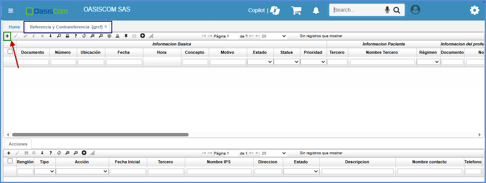
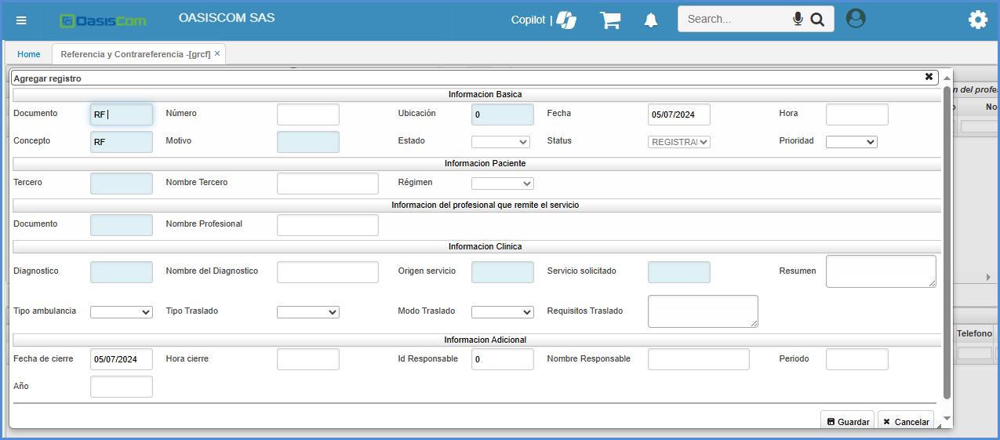
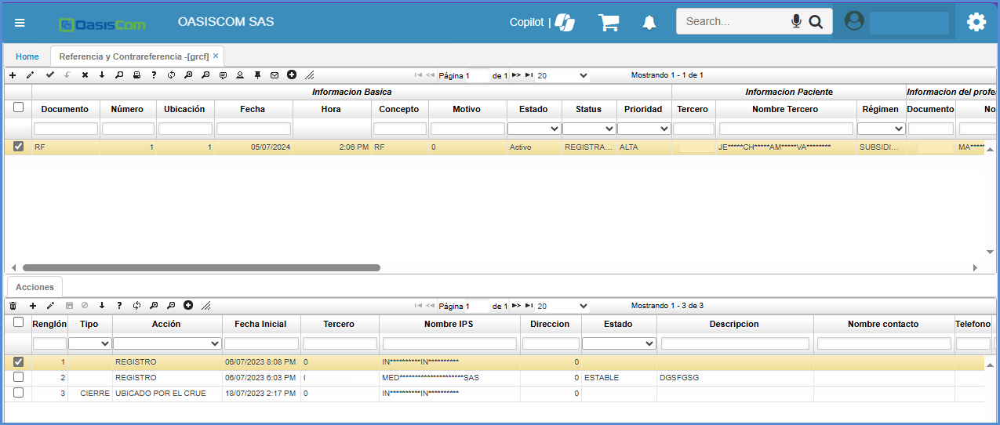

# Referencia y Contrareferencia - GRCF

Esta aplicación e sunicamente de referencia cuando se presenta una emergencia médica.

Se agrega un registro 

Una vez diligenciada esta información se guarda el registro y en el detalle, se trata esta referencia

Una vez terminado el proceso, se informa por terminado el registro 

