# Movimientos de Inventario - GMOV

## [**GMOV - Movimientos de inventario**](http://docs.oasiscom.com/Operacion/scm/inventarios/imovimient/imov#imov---movimientos-de-inventario)

Esta aplicación permite la ejecución de los principales movimientos que afectan el inventario, tales como entradas por compra, salidas por remisiones, salidas por consumo.  

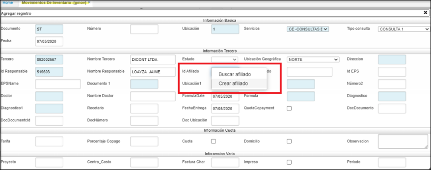

**Documento:** Nombre de documento parametrizado con anterioridad en la aplicación **BDOC**.  
**Número:** Numero consecutivo del movimiento.  
**Ubicación:** Número de ubicación de la empresa en donde se encuentra el producto.  
**Concepto:** Concepto del movimiento.  
**Motivo:** Motivo del movimiento.  
**Fecha:** Fecha en la que se realizará el movimiento.  
**Tercero:** Tercero asociado al movimiento.  
**Nombre de Tercero:** Nombre de tercero asociado al movimiento.  
**Moneda:** Tipo de moneda que se utilizara en el movimiento de inventarios.  
**Estado:** Estado en el que se encuentra el movimiento (Activo, procesado, Anulado).  
**Vendedor:** Tercero que está registrado como vendedor.  
**Tipo de precio:** Tipo de precio registrado con anterioridad en la aplicación **FBTP**.  
**Ubicación de destino:** Ubicación a donde será cargado el movimiento de productos.  

* **Creacion de terceros:**  
	clic derecho sobre el campo afiliado.  
    despliga el siguiente zoom, para ser editado:  
    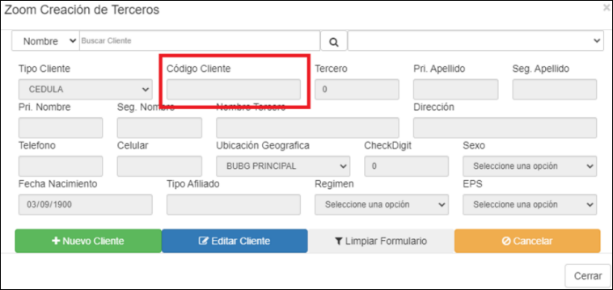  
    Cuando se digite el campo código cliente el sistema debería realizar lo siguiente:
Si en el campo de código cliente se registran sólo números al darle tab el sistema debe retornar lo mismo en el campo tercero.  
Iniciamos el proceso dando el en botón de nuevo cliente.  
Se puede validar que cada vez que se ingresa valores numéricos al darle tab el campo de tercero queda con el mismo valor ingresado.  
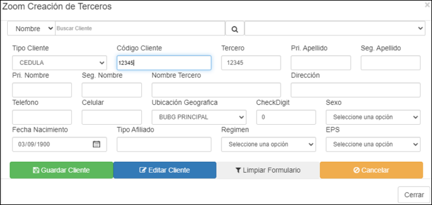  

    
En el detalle:

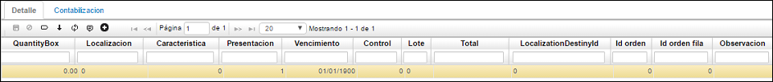

**Renglón:** Renglón de detalle asociado al movimiento.  
**Producto:** Código asignado al producto, anteriormente parametrizado en **BPRO**.  
**Nombre del Producto:** Nombre de producto.  
**Cantidad:** Cantidad por producto.  
**Costo unitario:** Costo por unidad de producto.  
**Unidad Medida:** Hace referencia a la unidad de medida del producto ejemplo, nidad.  
**Localización:** Identificación numérica de la localización de un producto.  
**Característica:** Código de la característica que se puede atribuir al producto.  
**Presentación:** Forma de presentación del producto.  
**Vencimiento:** Fecha de vencimiento del producto.  
**Control:** Número de serial o consecutivo asignado a productos que vende la empresa y poder así identificarlos y llevar un control sobre ellos.  
**Lote:** Si los productos pertenecen a un lote en específico.  

    

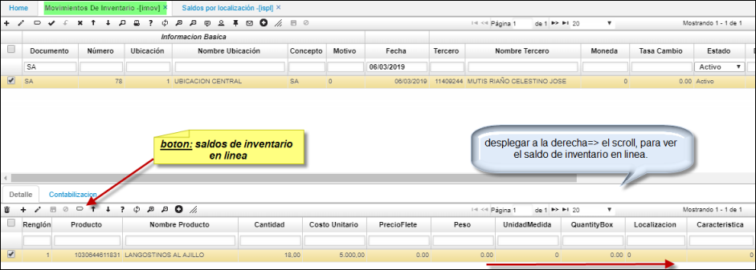

Detalle del **GMOV**.  

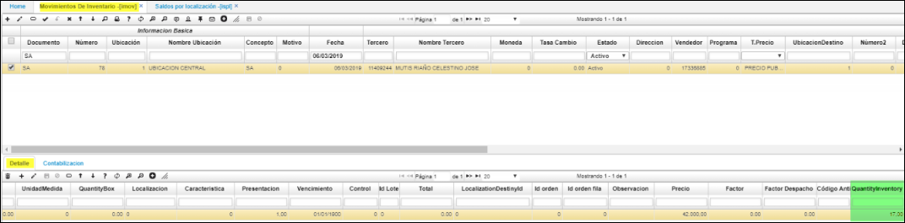

* Escenario dos: su saldo en linea permite realizar la transaccion, se mostrara en el campo QuantityInventory -1  indicando que existen saldos en linea para este producto.  

## [Vista Previa](http://docs.oasiscom.com/Operacion/scm/inventarios/imovimient/imov#vista-previa)

La funcionalidad de _Vista Previa_ muestra los movimientos de inventario despachado, relacionando la información diligenciada en la aplicación.  

Para acceder a la vista previa, seleccionamos un registro del maestro de la aplicación y damos click en el botón _Presentación preliminar_  ubicado en la barra de herramientas.  

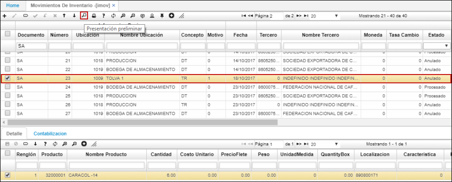

En seguida, se podrá ver el documento del movimiento de inventario seleccionado.  

El documento podrá ser exportado en formato de Excel, PDF o Word.  

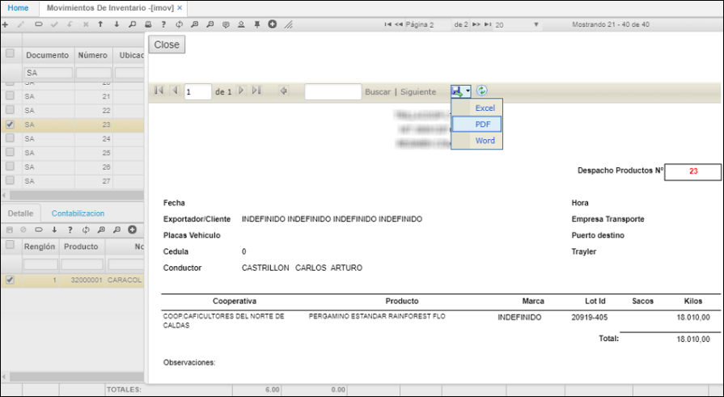

Al exportarlo en formato PDF.  

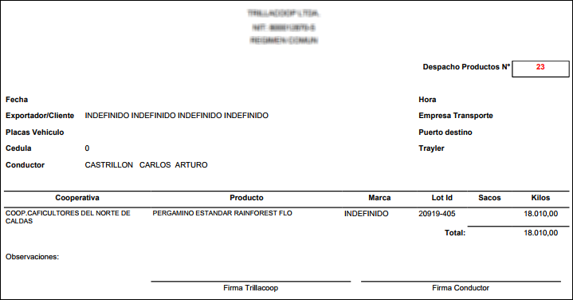

La información de la sección de _Talla_: cantidad, código antiguo, talla y color, el sistema la toma de los registros de la aplicación [**BPRO - Productos**](http://docs.oasiscom.com/Operacion/common/bprodu/bpro).  

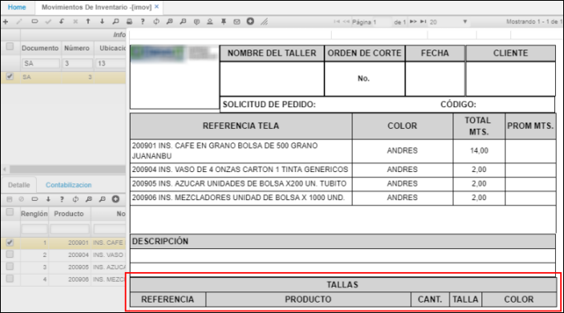

Cabe resaltar que, si al momento de realizar este registro no recordamos el número del pedido, en el campo número 1 se puede realizar doble clic y el sistema abre una ventana emergente con los pedidos relacionados a ese tercero y en esa respectiva ubicación:  

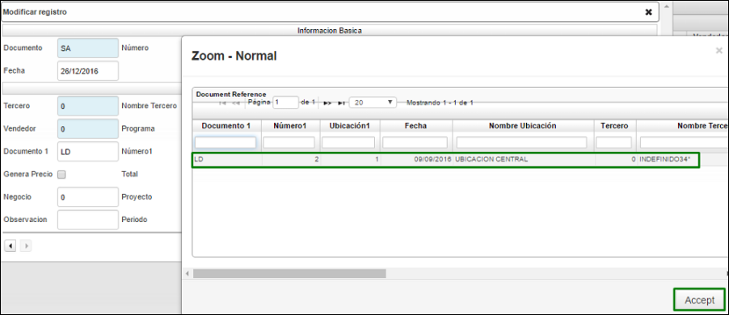

Se da clic en el botón aceptar y el sistema nos arroja el 2 en el campo número1.  

Al guardar el registro el sistema nos arroja automáticamente el detalle de acuerdo al pedido generado anteriormente, cabe resaltar que para que el sistema realice esto es necesario diligenciar los campos de color naranja de la imagen anterior para identificar a que pedido está asociado.  

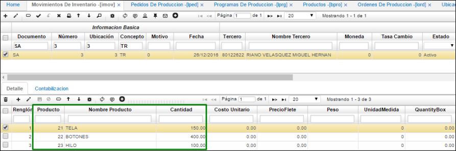

Se procesa el registro   

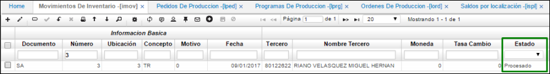

Para verificar que el inventario haya sido ajustado correctamente ingresaremos a la aplicación [**ISPL - Saldos por Localización**](http://docs.oasiscom.com/Operacion/scm/inventarios/isaldo/ispl#inventario-periódico-e-inventario-cíclico).  

## [**Salida de inventario por una orden de compra**](http://docs.oasiscom.com/Operacion/scm/inventarios/imovimient/imov#salida-de-inventario-por-una-orden-de-compra)

Una vez creada la orden de servicio y los productos correspondientes, se debe realizar la salida de inventario de los productos necesarios para realizar el mantenimiento al equipo. Esto se realiza a través de la opción **IMOV – Movimientos de Inventario**.  

[**Salida de inventario en GMOV**](http://docs.oasiscom.com/Operacion/scm/inventarios/imovimient/imov)

Creamos un nuevo registro en la aplicación GMOV y diligenciamos el formulario:  

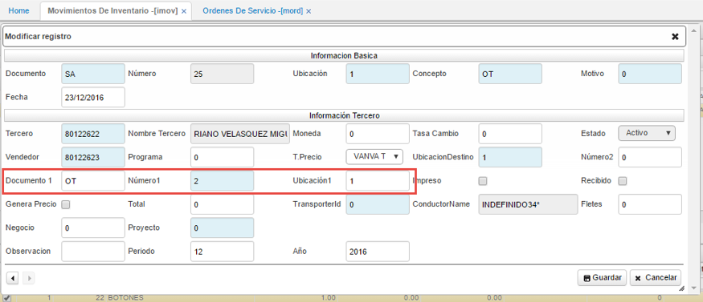

**Documento:** para esta opción se trabajará con el documento _SA_ que corresponde a una Salida de Inventario.  
**Ubicación:** se debe seleccionar ya sea desde el zoom o ingresarlo manualmente, la ubicación en donde se está separando el producto necesario para efectuar la orden de servicio.  
**Concepto:** se debe seleccionar el concepto por el cual se facturará la orden, en este caso es _OT – Cargo a Tercero_ dado que la factura será cargada al cliente propietario del equipo al cual se le realiza el mantenimiento.  

 _**NOTA:**_ Se debe considerar que, de acuerdo al concepto elegido, deben estar parametrizados de la siguiente manera en la opción [**BDOC - Documentos**](http://docs.oasiscom.com/Operacion/common/bsistema/bdoc):

 * Si se eligió **OT** en el campo concepto, en el campo _Clase_ del detalle de esta opción, debe estar seleccionada la opción _Cargo a tercero_:  

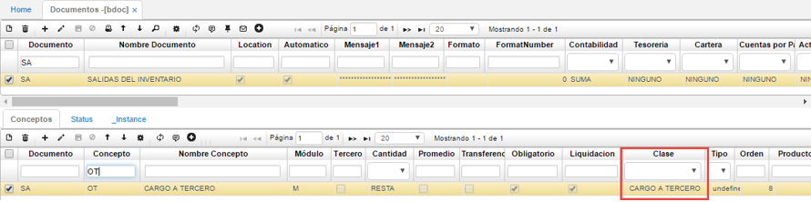

 * Si se eligió el concepto **GT**, en el campo _Clase_ del detalle de esta opción, debe estar seleccionada la opción _Garantía_:  

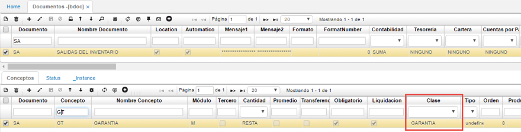

