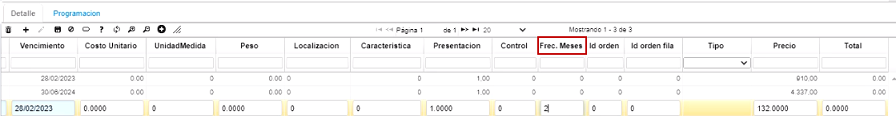
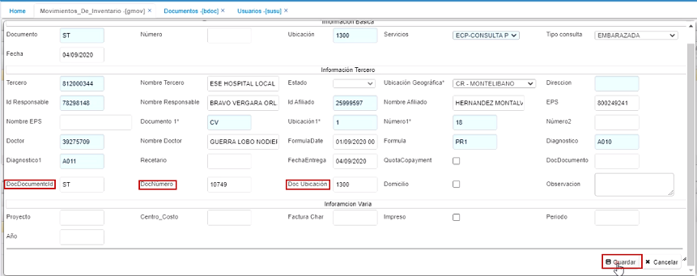

# Movimientos de Inventario - GMOV

* [Vista Previa](http://docs.oasiscom.com/Operacion/scm/inventarios/imovimient/imov#vista-previa)  
* [Salida de inventario por una orden de compra](http://docs.oasiscom.com/Operacion/scm/inventarios/imovimient/imov#salida-de-inventario-por-una-orden-de-compra)  
* [Salida de inventario en GMOV](http://docs.oasiscom.com/Operacion/is/hospital/ginventario/gmov#salida-de-inventario-en-gmov) 
* [Proceso de Dispensación de Medicamentos](http://docs.oasiscom.com/Operacion/is/hospital/ginventario/gmov#proceso-de-dispensación-de-medicamentos)

Esta aplicación permite la ejecución de los principales movimientos que afectan el inventario, tales como entradas por compra, salidas por remisiones, salidas por consumo.   

  

**Documento:** Nombre de documento parametrizado con anterioridad en la aplicación **BDOC**.  
**Número:** Numero consecutivo del movimiento.  
**Ubicación:** Número de ubicación de la empresa en donde se encuentra el producto.  
**Concepto:** Concepto del movimiento.  
**Motivo:** Motivo del movimiento.  
**Fecha:** Fecha en la que se realizará el movimiento.  
**Tercero:** Tercero asociado al movimiento.  
**Nombre de Tercero:** Nombre de tercero asociado al movimiento.  
**Moneda:** Tipo de moneda que se utilizara en el movimiento de inventarios.  
**Estado:** Estado en el que se encuentra el movimiento (Activo, procesado, Anulado).  
**Vendedor:** Tercero que está registrado como vendedor.  
**Tipo de precio:** Tipo de precio registrado con anterioridad en la aplicación **FBTP**.  
**Ubicación de destino:** Ubicación a donde será cargado el movimiento de productos.  

* **Creacion de terceros:**  

	clic derecho sobre el campo afiliado.  

    despliga el siguiente zoom, para ser editado:  

      

    Cuando se digite el campo código cliente el sistema debería realizar lo siguiente:  

Si en el campo de código cliente se registran sólo números al darle tab el sistema debe retornar lo mismo en el campo tercero.  

Iniciamos el proceso dando en el botón de nuevo cliente.  

Se puede validar que cada vez que se ingresa valores numéricos al darle tab el campo de tercero queda con el mismo valor ingresado.   

   

Para cuando se ingresa un valor alfanumérico; el sistema realiza la consulta del consecutivo del documento BT = BASICO TERCEROS.  

En el detalle:  

  

**Renglón:** Renglón de detalle asociado al movimiento.  
**Producto:** Código asignado al producto, anteriormente parametrizado en **BPRO**.  
**Nombre del Producto:** Nombre de producto.  
**Cantidad:** Cantidad por producto.  
**Costo unitario:** Costo por unidad de producto.  
**Unidad Medida:** Hace referencia a la unidad de medida del producto ejemplo, nidad.  
**Localización:** Identificación numérica de la localización de un producto.  
**Característica:** Código de la característica que se puede atribuir al producto.  
**Presentación:** Forma de presentación del producto.  
**Vencimiento:** Fecha de vencimiento del producto.  
**Control:** Número de serial o consecutivo asignado a productos que vende la empresa y poder así identificarlos y llevar un control sobre ellos.  
**Lote:** Si los productos pertenecen a un lote en específico.  

  

Detalle del **GMOV**.  

## [Vista Previa](http://docs.oasiscom.com/Operacion/scm/inventarios/imovimient/imov#vista-previa)

La funcionalidad de _Vista Previa_ muestra los movimientos de inventario despachado, relacionando la información diligenciada en la aplicación.  

Para acceder a la vista previa, seleccionamos un registro del maestro de la aplicación y damos click en el botón _Presentación preliminar_  ubicado en la barra de herramientas.  

Enseguida, se podrá ver el documento del movimiento de inventario seleccionado.  

El documento podrá ser exportado en formato de Excel, PDF o Word.  

Al exportarlo en formato PDF.  

La información de la sección de _Talla_: cantidad, código antiguo, talla y color, el sistema la toma de los registros de la aplicación [**BPRO - Productos**](http://docs.oasiscom.com/Operacion/common/bprodu/bpro).  

Cabe resaltar que, si al momento de realizar este registro no recordamos el número del pedido, en el campo número 1 se puede realizar doble clic y el sistema abre una ventana emergente con los pedidos relacionados a ese tercero y en esa respectiva ubicación:  

Se da clic en el botón aceptar y el sistema nos arroja el 2 en el campo número1.  

Al guardar el registro el sistema nos arroja automáticamente el detalle de acuerdo al pedido generado anteriormente, cabe resaltar que para que el sistema realice esto es necesario diligenciar los campos de color naranja de la imagen anterior para identificar a que pedido está asociado.  

Se procesa el registro   

Para verificar que el inventario haya sido ajustado correctamente ingresaremos a la aplicación [**ISPL - Saldos por Localización**](http://docs.oasiscom.com/Operacion/scm/inventarios/isaldo/ispl#inventario-periódico-e-inventario-cíclico).  

## [Salida de inventario por una orden de compra](http://docs.oasiscom.com/Operacion/scm/inventarios/imovimient/imov#salida-de-inventario-por-una-orden-de-compra)

Una vez creada la orden de servicio y los productos correspondientes, se debe realizar la salida de inventario de los productos necesarios para realizar el mantenimiento al equipo. Esto se realiza a través de la opción **IMOV – Movimientos de Inventario**.  

## [Salida de inventario en GMOV](http://docs.oasiscom.com/Operacion/is/hospital/ginventario/gmov#salida-de-inventario-en-gmov)  

Creamos un nuevo registro en la aplicación GMOV y diligenciamos el formulario:  

**Documento:** para esta opción se trabajará con el documento _SA_ que corresponde a una Salida de Inventario.  

**Ubicación:** se debe seleccionar ya sea desde el zoom o ingresarlo manualmente, la ubicación en donde se está separando el producto necesario para efectuar la orden de servicio.  

**Concepto:** se debe seleccionar el concepto por el cual se facturará la orden, en este caso es _OT – Cargo a Tercero_ dado que la factura será cargada al cliente propietario del equipo al cual se le realiza el mantenimiento.  

 _**NOTA:**_ Se debe considerar que, de acuerdo al concepto elegido, deben estar parametrizados de la siguiente manera en la opción [**BDOC - Documentos**](http://docs.oasiscom.com/Operacion/common/bsistema/bdoc):

 * Si se eligió **OT** en el campo concepto, en el campo _Clase_ del detalle de esta opción, debe estar seleccionada la opción _Cargo a tercero_:  

 * Si se eligió el concepto **GT**, en el campo _Clase_ del detalle de esta opción, debe estar seleccionada la opción _Garantía_:  

  

## [Proceso de Dispensación de Medicamentos](http://docs.oasiscom.com/Operacion/is/hospital/ginventario/gmov#proceso-de-dispensación-de-medicamentos)  

Hay que tener en cuenta que debe existir un Contrato previamente creado en la aplicación **VCNT** [Contratos de Venta - Dispensación de medicamentos](http://docs.oasiscom.com/Operacion/scm/ventas/vcontrato/vcnt#contratos-de-venta---dispensación-de-medicamentos) .  

Para el proceso de dispensación de medicamentos, se adiciona un nuevo registro (+).  En el campo _Documento_, siempre se elige la opción **_ST_** que corresponde a **Salidas de Inventario**; en el campo _Ubicación_, el código de la farmacia que corresponda;  en el campo _Servicios_, el servicio que corresponda.  En este campo, es importante tener en cuenta que si se escoge la opción _**Capitado**_, es porque se va a dispensar algo del **Contrato de Cápita** y si se elige el de **Evento** es para dispensar algo del **Contrato de Evento**.  Para el ejemplo en este caso, se selecciona uno de _**Evento**_;  en el campo _Tipo de Consulta_, se elige del menú el que corresponda.  Para el ejemplo, se escoge la opción _**Embarazada**_.  

  

Nota: En la aplicación **GMOV**, Los campos  _Servicios_ y _Tipo de Consulta_, son parametrizables en la opción **BDOC**.  Al ingresar a la aplicación, se elige el _Documento_ **_ST_** y en la parte inferior, aparecen todos los _Conceptos_ y en el campo _**Tipo**_, se elige si es **Capitado** o **Evento**.  

  

Continuando con el registro en **GMOV**, en el campo _Fecha_, se escribe la fecha del registro de la Dispensación;  el campo _Tercero_, se toma automáticamente de la aplicación **SUSU**, de lo que se tiene registrado en el _Usuario_, en el campo **_Organización_**. 

  

  

Retomando **GMOV**, en el campo _ID Afiliado_, se registra la cédula del afiliado.  En este campo, se puede entrar a buscar o se escribe si ya se conoce.  Al dar tab, el sistema diligencia el nombre, la EPS que tiene asociada.  El Contrato es el que ya se registró con anterioridad y el que está asociado al _Servicio_ porque es _Evento_ y al _Tercero_ que ha sido seleccionado.  

En el campo _Doctor_, se registra el número de documento del doctor si se conoce o se puede buscar; en el campo FormulaDate, va la fecha en la que se registra la fórmula; en el campo _Fórmula_, se registra el número de referencia de la fórmula; en el campo _Diagnóstico_, se busca por Zoom el diagnóstico que aparece en la fórmula; en el campo _FechaEntrega_, la fecha en la que se entrega el medicamento; si la dispensación se hace a domicilio, se activa el check.  

  

Se guarda el registro.  

  

En la parte inferior, se entra a asociar los productos que corresponden. Se adiciona un registro(+).  En el campo _Producto_, se da click derecho y se elige la tercera opción: _Seleccionar productos para agregar al detalle_  

  

La anterior selección, permite que el sistema muestre el inventario que hay disponible en la farmacia.  

  

En este ejemplo, se elige un producto. El sistema muestra la cantidad y se resigtra la cantidad que se va a dispensar.  

  

  

  

En el campo _Requerida_ en la parte inferior, se registra la misma cantidad (para el ejemplo, 2), se diligencian los campos _Duración_, _Frecuencia_ y se guarda el registro.  

  

  

Hay medicamentos que pueden quedar pendientes, por ejemplo, en la farmacia solo había 3 unidades disponibles pero la fórmula decía que requería de 5 unidades.  El proceso a seguir es el siguiente: se adiciona un nuevo registro (+) o producto con el mismo proceso que se acaba de explicar arriba.  Pero ahora en el campo _Cantidad_, se digita 3 que es la cantidad que hay en la farmacia de existencia y en el campo _Requerida_ se digita 5 que es la requerida en la fórmula.  Se digitan igual los campos _Duración_ y _Frecuencia_ y se guarda el registro.  

  

También existe la posibilidad de la programación.  La programación es un tratamiento que se debe dar en la fórmula.  Cuando se necesita un medicamento por 2, 3 meses o más.  Se adiciona un registro (+), se busca el medicamento, se hace el mismo proceso; se llenan los mismos campos de _Cantidad_, _Requerida_, _Duración_, _Frecuencia_.  Al lado derecho, se encuentra un campo llamado _Frec.Meses_: en este, se escribe por cuántos meses adicionales se va a realizar la entrega de ese medicamento.  En el ejemplo, el campo se llena con el número 2 ya que el tratamiento es para 3 meses.  Luego, se guarda el registro.

  

  

Adicionalmente, se ejecuta el botón que se llama _Programación/Pendiente_.  

  

  

El sistema, en la pestaña _Programación_, suministra la siguiente información: Para el producto que quedo pendiente (campo _Tipo_), se deben entregar 2 (campo _Requerida_) dentro de las siguientes 48 horas (campo _ScheduledDate_); y para el producto que quedó programado (campo _Tipo_), se deben entregar 10 (campo _Requerida_) en un mes (campo _ScheduledDate_).  

  

Ahora, se procesa la dispensación.  

  

Si se quiere entrar a registrar el pendiente cuando ya se tenga, entonces se adiciona un nuevo registro (+) en el maestro, se registra la fórmula, se da _tab_ y el sistema trae automáticamente todos los datosque se tenían en esa fórmula.  Adicionalmente, trae en los campos _DocDocumentoId_, _DocNúmero_ y _DocUbicación_, la relación del documento original.  Si se requiere modificar algo, se hace, sino, se guarda el registro.  

  

Se procede a buscar la fórmula. Se señalan los registros y se procede a cambiar la fecha a la dispensación que se acaba de generar.  

  

  

  

  

  

  

Se señala el registro y se da click en editar o modificar registro.  

  

Para que quede con la fecha del día siguiente.  

Es importante resaltar que las fechas que tiene en cuenta el programa en cuanto a pendientes y programadas, son las del campo _FechaEntrega_; es decir, si la programación se hace para dentro de un mes, en este campo debe estar la fecha del mes siguiente.  En el ejemplo, se va a dejar la fecha del día siguiente para asumir que se realiza la entrega del pendiente y se guarda el registro.  

  

Al dar click en guardar, el sistema trae el pendiente con sus 2 unidades para el ejemplo y luego se procesa el registro.  

  

Se le debe decir al sistema de qué lote y vencimiento se va a sacar el producto o medicamento.  

  

Se da clik en guardar y luego en procesar.  

  

  

Al dar click en procesar, el sistema en la dispensación original, en la pestaña _Progrmación_, dice que el _Pendiente_, se encuentra en Estado _Terminado_ y asocia con la dispensación con la que se realizó esa entrega.  

  

Cuando se empieza a realizar el proceso de las programaciones mensuales, aparecerán también con el Estado _Terminado_ e indicando cuál fue la dispensación que se generó.

