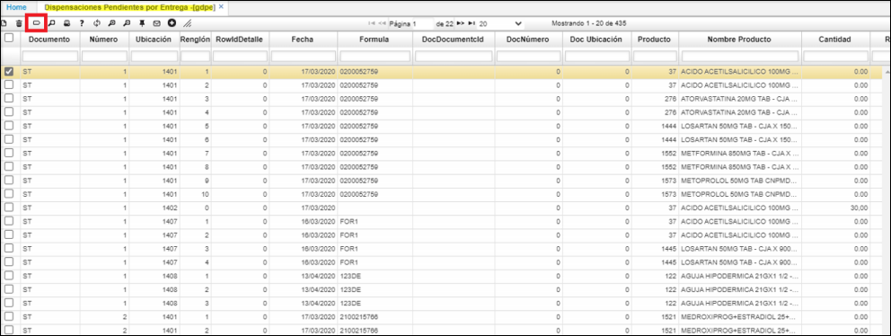
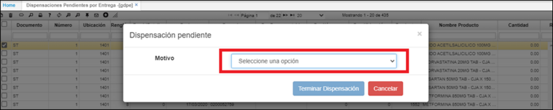

# Dispensaciones Pendiente por Entrega  [GPDE]

Se crea **GDPE**, esta opción se podrán consultar las dispensaciones ya sean de “Programación” o “Pendientes”, es decir que estén en estado “Activo”. En esta misma opción se tendrá el botón que hará el proceso de terminación de las dispensaciones.  

Se tiene configurado botón que muestra los motivos por la que se termina el proceso.  
  

La lista sobre este zoom, se muestra de la siguiente característica.  
El proceso que se realiza sobre el botón de terminar dispensación.  
Se actualiza el estado indicando el motivo seleccionado sobre el zoom.  
Parametrización que se debe editar según cada cliente.  

  

