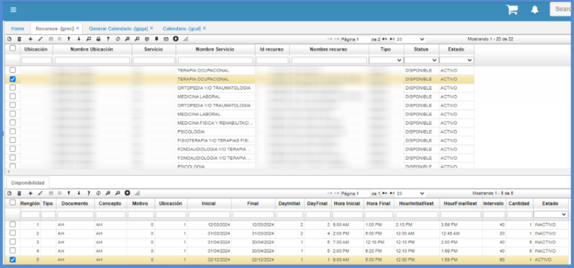
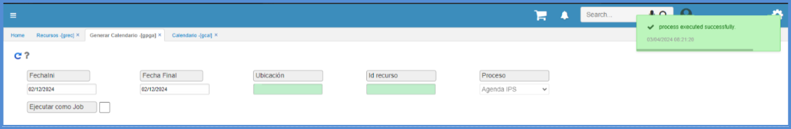
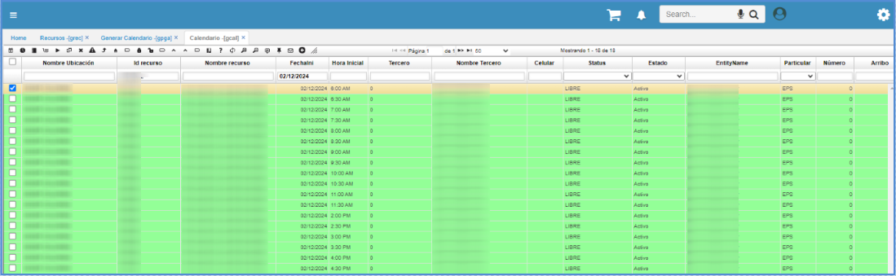

# Generar calendario - GPGA

Para generar el calendario de un recurso (Doctor), se deberá ingresar a la opción **GPGA – Generar Calendario**.  

**Fecha Ini** y **Date Final** se deberán ingresar las mismas fechas de inicio y fin que fueron ingresadas en el registro del detalle de la opción **GREC – Recursos**.  

**Ubicación**: se deberá ingresar también la ubicación (sede) en la que se encuentra laborando el recurso. Esta ubicación debe ser la misma que se ingresó en el registro del detalle de la opción **GREC – Recursos**.  

**Id Recurso**: se deberá ingresar el número de identificación del doctor sobre el cuál se generará el calendario, teniendo en cuenta los parámetros anteriormente ingresados y que estos deben concordar con el registro de la opción **GREC – Recursos**.  

Posteriormente, se dará clic en el botón.  

Hecho esto, para verificar que el calendario ha sido creado correctamente, se deberá abrir la opción **GCAL - Calendario** y en el campo _Id Recurso_ ingresar el número de identificación del doctor sobre el cual se generó el calendario, es decir, el mismo ingresado en la opción **GPGA – Generar Calendario**.  

Al consultar, puede verse una serie de registros generados los cuales corresponden a la planeación del recurso de acuerdo a su horario laboral y el intervalo de tiempo que tendrá disponibilidad para atender a los pacientes.

# Modificación del Calendario

En este paso a paso se describe el proceso que permite generar un calendario nuevamente aún cuando este ya haya sido generado, donde también se describe las condiciones necesarias para que este proceso pueda ser realizado. 

En este proceso será necesario verificar en el [**GCAL - Calendario**](https://docs.oasiscom.com/Operacion/is/hospital/gcita/gcal), que todos los registros del calendario que se van a modificar estén en **ESTADO LIBRE**, ya que si no se cumple con esta condición el sistema no permitirá la generación del calendario.  

Luego de verificar esta condición se ingresa al [**GREC - Recursos**](https://docs.oasiscom.com/Operacion/is/hospital/gbasica/grec) y se crea (o se habilita en caso de ya estar creada) la disponibilidad del recurso en el rango de fechas que se necesita.

Una vez realizado este proceso en el **GREC - Recursos**, ingresar a la aplicación [**GPGA - Generar Calendario**](https://docs.oasiscom.com/Operacion/is/hospital/gproceso/gpga) para realizar la creación del calendario. 
En esta aplicación se diligencian los campos correspondientes, teniendo en cuenta que los campos que se llenan en el **GPGA - Generar Calendario** y deben ser los correspondientes a los cambios realizados en el **GREC - Recursos**.
 
- **FechaIni y Fecha Final:** Deben ser las mismas que se establecieron en el detalle de la aplicación **GREC - Recursos**.  
- El campo **Ubicación**, la misma ubicación del **GREC - Recursos**.  
- En el **Id Recurso** debe ir el número de documento del profesional.

Tras realizar el proceso, se ingresa de nuevo al **GCAL - Calendario**, en el que, se consulta el calendario en la fecha en que se haya realizado la modificación, se tiene el nuevo calendario con las modificaciones que se realizo. 

