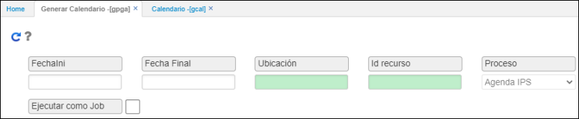
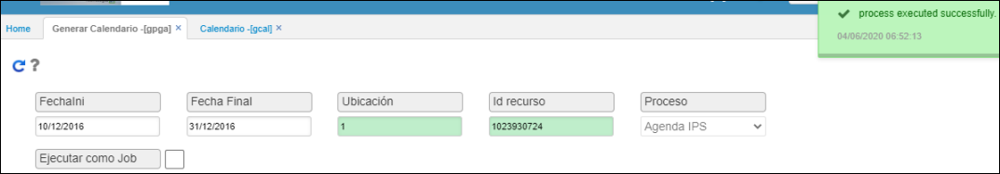

# GENERAR CALENDARIO - GPGA

Para generar el calendario de un recurso (Doctor), se deberá ingresar a la opción **GPGA – Generar Calendario**.  

**Fecha Ini** y **Date Final** se deberá ingresar las mismas fechas de inicio y fin que fueron ingresadas en el registro del detalle de la opción **GREC – Recursos**.  

**Ubicación**: se deberá ingresar también la ubicación (sede) en la que se encuentra laborando el recurso. Esta ubicación debe ser la misma que se ingresó en el registro del detalle de la opción **GREC – Recursos**.  

**Id Recurso**: se deberá ingresar el número de identificación del doctor sobre el cuál se generará el calendario, teniendo en cuenta los parámetros anteriormente ingresados y que estos deben concordar con el registro de la opción **GREC – Recursos**.  

Posteriormente, se dará clic en el botón.  

Hecho esto, para verificar que el calendario ha sido creado correctamente, se deberá abrir la opción **GCAL - Calendario** y en el campo _Id Recurso_ ingresar el número de identificación del doctor sobre el cual se generó el calendario, es decir, el mismo ingresado en la opción **GPGA – Generar Calendario**.  

Al consultar, puede verse una serie de registros generados los cuales corresponden a la planeación del recurso de acuerdo a su horario laboral y el intervalo de tiempo que tendrá disponibilidad para atender a los pacientes.

