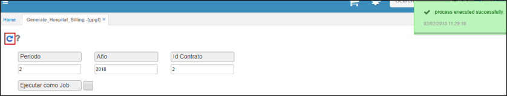

# GPGF - Generación de Facturación

El proceso **GPGF** permite automatizar la generación de facturación según el contrato de afiliación.  

En la aplicación ingresamos el periodo del cual se generará la facturación, el año y el número de contrato del afiliado. Los contratos se realizan en la opción **GCNT - Contratos**.  

Damos click en el botón  y el sistema arrojará un mensaje de control indicando que se generó la facturación correctamente.  

Para consultar la facturación generada automáticamente por el sistema, ingresamos a la aplicación **GFAC - Facturas** y filtramos por periodo.  

