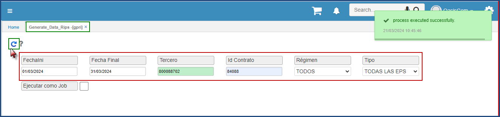
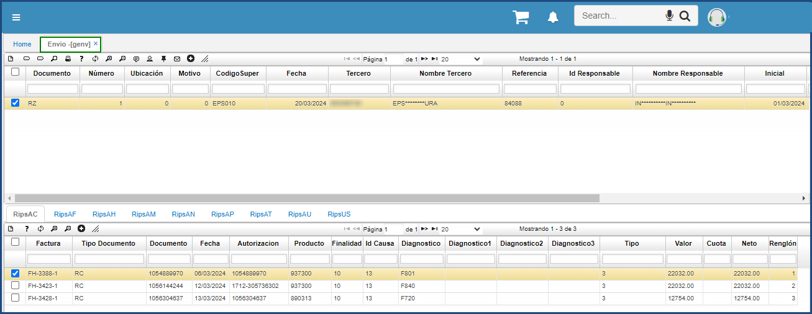
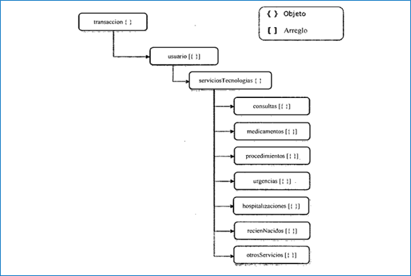
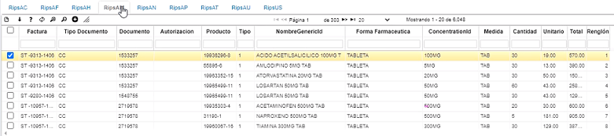
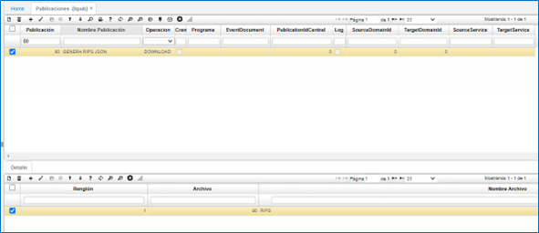
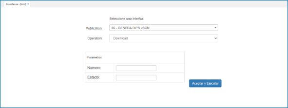

# Generación de RIPS - GPRI  

El proceso para la generación de RIPS, comienza en la vista **GPRI**  **Generación de datos para RIPS** 

  

En esta aplicación se ingresa una fecha inicial y final, de igualmente un tercero donde normalmente se selecciona una entidad y se genera todos los registros en la tabla RIPS teniendo en cuenta una fecha, un contrato, un régimen, tipo y se presiona el botón recargar ubicado en la parte superior color azul, una vez realizado estos pasos se empieza a generar el proceso RIPS donde se llenan los datos de transacciones, usuarios, consultas, medicamentos, procedimientos, urgencias, hospitalizaciones, recién nacidos y otros servicios.  

En esta aplicación se puede visualizar la información, donde inicialmente se puede ver las transacciones, donde aparece un numero de factura, se debe tener cuenta que cada transacción tiene una factura que esta relacionado a un usuario, y a su vez tiene asociado unos servicios tecnológicos, como se puede observar en la siguiente imagen. 

  

Como se puede visualizar el JSON debe tener un objeto principal que es la transacción donde se visualiza el número de factura y el NIT del facturador principalmente, dentro de este se encuentra asociado un objeto de usuarios, siendo este un arreglo donde puede ser el mismo tercero pero con un consecutivo diferente, este a su vez tiene un objeto de servicios tecnológicos donde se almacena las consultas, medicamentos, procedimientos, urgencias, hospitalizaciones, recién nacidos y otro servicios, por ultimo se destaca que se va entregar un arreglo de transacciones en el Archivos JSON que se genera. 

  

Para la descarga del Archivos JSON de RIPS se debe tener en cuenta que se hace por medio del **BINT - Interfaces** y para ello existe una parametrización, inicialmente se crea el ítem 80 en el  **BARC - Archivos**, donde se visualiza el nombre denominado RIPS, de igual forma el formato debe ser JSON, y el campo QUERY SQL es donde se almacena la consulta, donde se forma la estructura que debe devolver el JSON, en el cual se puede modificar si necesita otros campos o modificar su nombre si la resolución cambia, en el detalle de este ítem  80, se deben registrar los argumentos que se van a tener en cuenta como parámetros de búsqueda, en este caso se usa el número y el estado. 

  

La otra opción que se debe parametrizar es en el **BPUB -Publicaciones**, en este caso se puede visualizar el registro numero 80, donde se especifica que la operación es tipo descarga y en el detalle se asocia la opción 80 creada previamente en la opción **BARC - Archivos**. 

Por último para la generación del Archivos JSON se ingresa al BINT donde se ingresa el numero y estado, argumentos parametrizados previamente en la opción **BARC - Archivos** y se presiona el boto aceptar y ejecutar, donde dependiendo de la cantidad de registros en unos minutos se podrá visualizar el Archivos en la opción descargas del navegador. 

