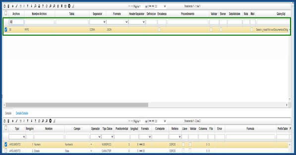
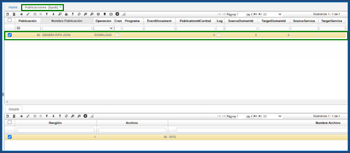
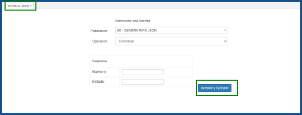

# Generación de RIPS - GPRI  

En esta aplicación, se muestra el proceso de generación de RIPS desde OASISCOM.

Se registra el rango de fechas en donde se va a generar el RIP;  se trae el tercero; se asocia la referencia del contrato, que se puede buscar en la aplicación [Contratos de Venta - VCNT](http://docs.oasiscom.com/Operacion/scm/ventas/vcontrato/vcnt), en el campo _**Contrato Cliente**_, en el campo _**Régimen**_, si se quiere un solo RIP para los dos regímenes, se selecciona _**Todos**_; si se quiere por cada uno, se selecciona _**Régimen**_;  de la misma forma funciona para el campo _**Tipo**_,  si es un RIP para todas las EPS, se selecciona _**Todas las EPS**_, si es un RIP por cada EPS, se selecciona _**Por EPS**_.  A continuación, se procesa el registro.  

  

  

Una vez ejecutado el proceso, se ingresa a la aplicación Envío - GENV; se consulta para la fecha y se puede apreciar que el sistema generó para este caso, dos RIPS.  Todo esto es con base en la información que se tiene en  [Movimientos de Inventario - GMOV](http://docs.oasiscom.com/Operacion/is/hospital/ginventario/gmov), de las dispensaciones que se han realizado asociadas a los contratos tipo Cápita.  

  

En la parte inferior, el sistema va a mostrar el detalle de cada uno de esos RIPS, por ejemplo, todas las transacciones, los medicamentos, otros servicios si se llegaran a tener y también todo el tema relacionado con los usuarios.

  

  

  

  

Se debe entrar a generar una validación.  El sistema inicialmente, deja el RIP con un _**Status**_ _Generado_ y posterior a la validación del Usuario, se oprime la opción _**Rips Validado**_. 

  

Entonces, el sistema cambia el _**Status**_ a _Validado_.  

Una vez realizado este proceso, se ingresa a [Interfaces - BINT](http://docs.oasiscom.com/Operacion/utility/barchi/bint).  En el campo _**Operation**_, se elige la opción _**Genera RIPS**_.  En la parte inferior en _Parámetros_, en el campo _Número_ se le indica el número del RIP que se validó y en el campo _Estado_, la opción _V_ de _Validado_.  Posteriormente, se ejecuta la operación.  

  

Con esto, el sistema trae el _.ZIP_ de los RIPS.  Se abre el archivo.  

  

Se verifica que en todos los documentos, se encuentre información.  

Una vez realizado el proceso de verificación de que haya información en todos los archivos _.ZIP_, se regresa a la apliación **Contratos de Venta - VCNT** y se da el _Status_ _Terminado_.  Y con esto, se le indica al sistema que ya se realizó todo el proceso.  

  

  

  

