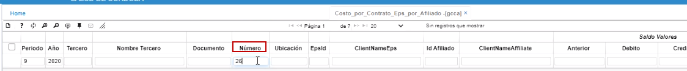
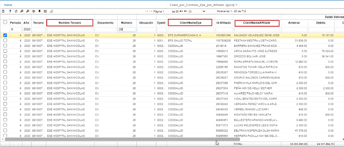
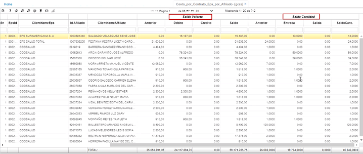

# Costo por contrato eps por afiliado - GCCA  

Este reporte muestra por contrato, por eps, por afiliado.  Este reporte se consulta por número de contrato.

  

Entonces el sistema muestra el tercero asociado a ese contrato, por cada una de las EPS, con los afiliados asociados, también con valores y cantidades de lo que se ha dispensado.

  

  

