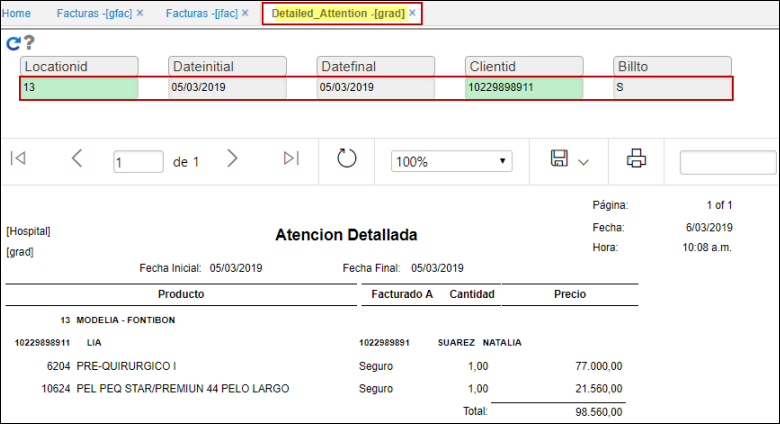
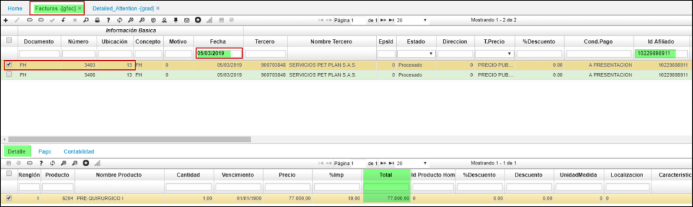

# GRAD - Detailed Attention

Detalla uno a uno los productos incluidos en las respectivas facturas GFAC, JFAC; permitiendo consultar por variables independientes o conjuntas; ubicación, fecha inicial, fecha final, cliente, "Billto" o “cobrar a”: "S".
En la estructura del reporte se detalla los productos, cantidad y valor.

