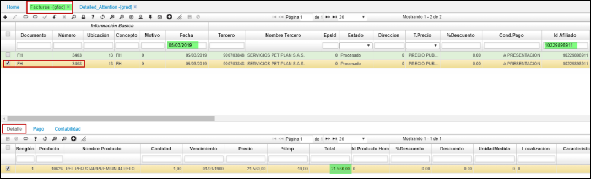

# GRAD - Detailed Attention

Detalla uno a uno los productos incluidos en las respectivas facturas GFAC, JFAC; permitiendo consultar por variables independientes o conjuntas; ubicación, fecha inicial, fecha final, cliente, "Billto" o “cobrar a”: "S".
En la estructura del reporte se detalla los productos, cantidad y valor.
Reporte del modulo de hospital.

* para el siguiente ejemplo se detallan dos producto por valor de $98.560  

* En la factura GFAC=3408 se factura el primer producto por $21.560  

* En la segunda factura GFAC=3403 detalla el otro producto -PRE-QUIRURGICO I- por $77.000  

# GRAD - Detailed Attention

*se relaciona el total.  

