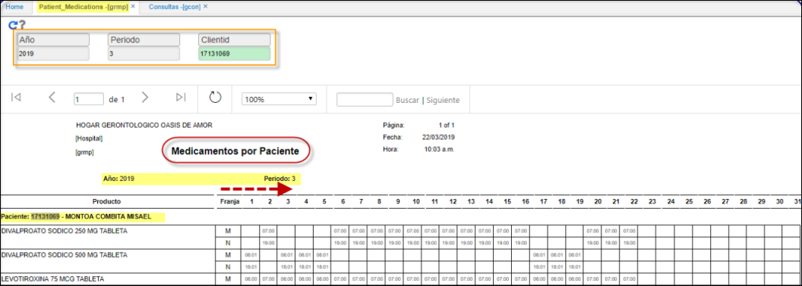
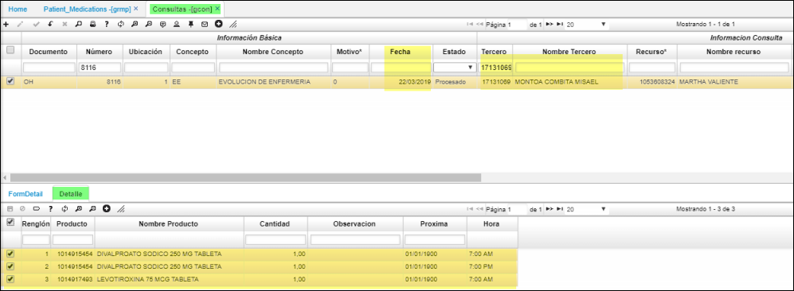

# GRMP - Medicamentos por Paciente

Reporte que indica el resumen mensual, por paciente de los medicamentos aplicados, durante las evoluciones por enfermería o consultas médicas en **GCON**.  
Para el citado paciente tuvo una consulta medica en el mes de marzo del 2019, donde se le suministraron tres medicamentos; estos se reflejan en el reporte **GRMP** - Medicamentos por Paciente.
* Los filtros de consulta son; año, periodo, cliente (paciente).  
El reporte discrimina la franja entre mañana y noche.  

Consultas medicas.

*********