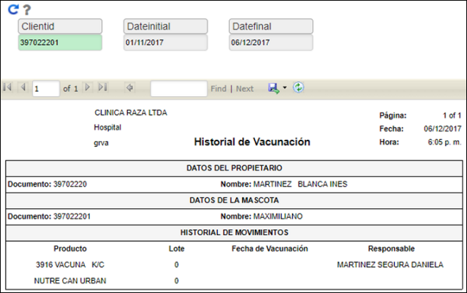

# GRMP - Medicamentos por Paciente

En este reporte se puede visualizar el historial de vacunación de las mascotas, se debe diligenciar el id que identifica a la mascota y las fechas en la cuales se solicita la historia de vacunación:

