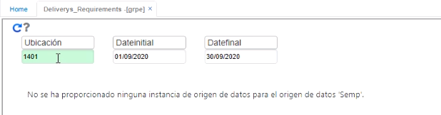
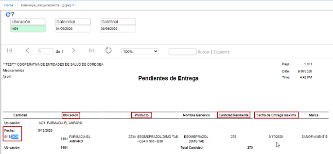

# Requerimientos Pendientes - GRPE  

Este reporte permite ver todas las dispensaciones que hay pendientes, los productos que se encuentran pendientes por entregar.  Se consulta un rango de fechas y se ejecuta el reporte.  

Para la ilustración, el sistema indica que hay una dispensación pendiente de fecha 15 de septiembre y nos muestra la ubicación, el producto, la cantidad pendiente por entregar y también la fecha máxima de entrega.  

  

