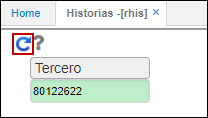
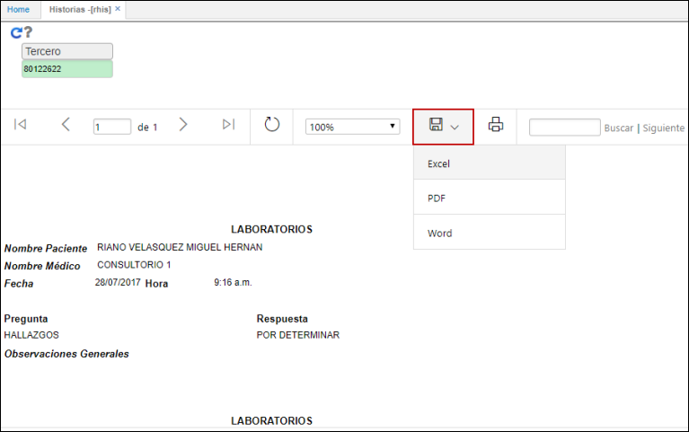
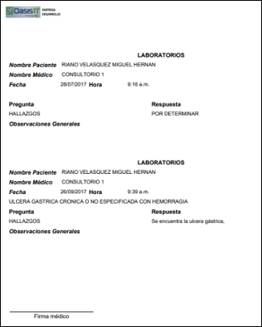
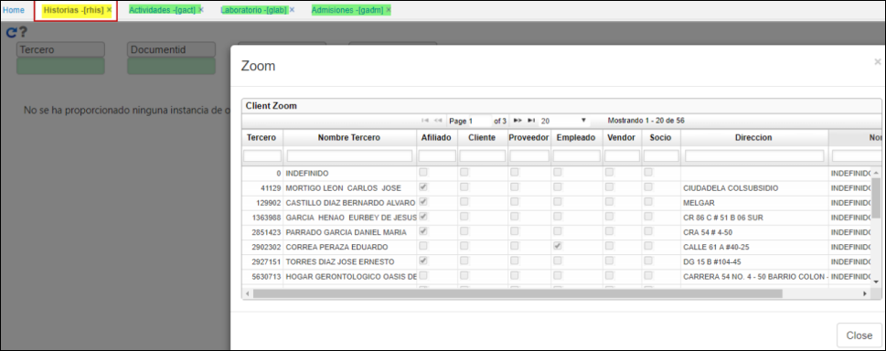

# RHIS - Historias

La aplicación RHIS permite la visualización de información relacionada a la historia clinica de un paciente en un rango de fechas.  

Para consultar, ingresamos el número de documento de identidad y damos click en consultar.  

El sistema arrojará un historíco de la información clínica del paciente. Esta información puede ser exportada en formato Excel, PDF o Word. Igualmente, está la posibilidad de imprimir directamente el reporte.  

El reporte descargado en formato PDF.  

- Este reporte visulizara los datos que se hayan ingresado en **[GCAT] ACTIVIDADES, [GLAB] LABORATORIO, [GADM] ADMISIONES.**  
Se mostrara la firma del medico.

