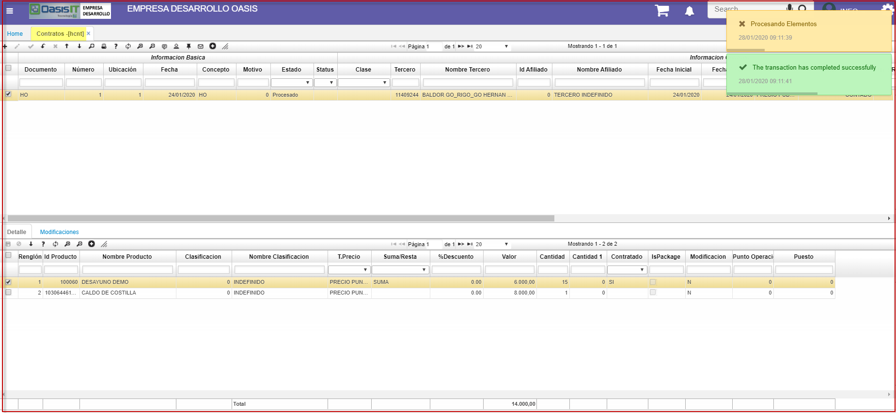

# Contratos Hotel

La aplicación **HCNT** permite crear los contratos correspondientes al módulo de Hotelería. En este programa se podrá configurar los productos al que se tendrá acceso el cliente de la compañía.  
Allí ingresaremos el documento, la ubicación, el concepto, así como el tercero responsable del contrato y el afiliado. Las fechas de inicio y fin del contrato y el producto por el cual se realiza el contrato.  

