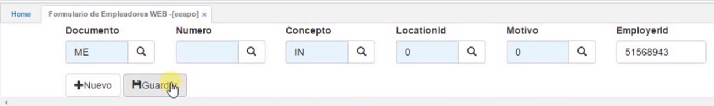

# Formulario de Empleadores web - EEAPO

Permite registrar los afiliados aportantes al régimen contributivo en WEB.  El formulario consta de los siguientes campos:  

_Documento:_  En este campo hay un Zoom.  Al dar click, se ve una sola opción que es _**ME**_ de _Movimiento empleador_.  Se selecciona y se cierra el Zoom.
_Número:_  Lo diligencia automáticamente el sistema.
_Concepto:_  También hay un Zoom con dos opciones.  Se elige la opción _**IN**_ de _Inscripción_.  
_LocationId:_ Del Zoom, se elige la opción correspondiente según el caso.  
_Motivo:_ También se abre el Zoom y se selecciona el 0 (cero), correspondiente a ingreso.  
_EmployerId:_  En este campo se tiene la posibilidad de diligenciar el NIT o número de cédula del aportante.  

Llenados estos campos, se _Guarda_ el registro.  

  

Se despliega otro formulario con los siguientes campos:  

_Fecha inscripción:_  Se selecciona la fecha correspondiente.  
_Tipo documento:_  Se abre el Zoom y se selecciona el tipo de documento que corresponda, si es NIT, se selecciona **NI**.  
_Número de identificación:_ Se digita el número de identificación relacionado con el campo anterior.  
_Nombre o razón social:_  El nombre de la empresa.  
Los siguientes campos, _Primer nombre_, _Segundo nombre_, _Primer apellido_, _Segundo apellido_, se diligencian cuando es una persona natural.  
_Clase aportante:_  Hay un Zoom donde del cual elegimos la opción que corresponda (grande, pequeña, etc.)    
_Sector del aportante:_  Se elige el sector al que pertenece el aportante (público, privado, etc.)  
_Número de empleados:_  Cantidad de empleados que tiene la empresa.  
_Tipo de aportante:_  Del Zoom, se selecciona el que corresponda (Empleador, pagador de pensiones, etc.)  
_Código CIIU:_  Se selecciona el que corresponde a la empresa (descripción de actividades económicas)  
_Departamento y Municipio:_  Se seleccionan de acuerdo a la ubicación de la empresa.  
Se llenan los campos _Dirección_, _Barrio_, _teléfono_, _celular_, _correo_.  
_Banco:_  En este campo, se abre el Zoom y se elige el banco al cual se encuentra vinculado el aportante.  
_Tipo de cuenta:_  Se selecciona el tipo de cuenta (ahorros, etc.)  
_Número de cuenta:_  Se escribe el número.  
_Nombre Representante:_  Se escribe el nombre del Representante legal de la empresa.  
_Tipo doc. rep. legal:_ Se escribe la clase de documento (cédula, etc.)  
_No doc. Representante legal:_  Se escribe el número del documento según el campo anterior.  
_Fecha de nacimiento Rep. legal:_  Se escribe del calendario.  
_Correo Representante legal:_  El correo electrónico del representante legal.  
Los siguientes datos son los del Contacto de la empresa (_Nombre_, _Cargo_, _Teléfono_, _Celular_, _Fecha de nacimiento_, _Correo_.  

Diligenciados todos estos campos, se guarda el registro.  

  

Es importante tener en cuenta que para poder procesar el formulario, se deben haber adjuntado los documentos necesarios que son: Fotocopia del documento de identidad, Formato de inscripción y Fotocopia del NIT.  Estos documentos son obligatorios de acuerdo a la parametrización en la aplicación [**BMOT – Motivos**](http://docs.oasiscom.com/Operacion/common/bsistema/bmot).  Para adjuntar los documentos, se da click en el botón adjuntar al lado derecho del botón guardar; se van adjuntando los archivos y se da click en el botón verde de aceptar y luego en el de guardar cambios; uno a uno hasta adjuntar los 3 documentos.  

  

Luego de terminado este proceso, se guarda y se procede a Procesar el registro.  

  

Ahora, se abre la aplicación [**Formulario de empleadores - EAPO**](http://docs.oasiscom.com/Operacion/is/salud/eafiliacion/movadm/eapo) para verificar que el estado del formulario es _Procesado_, filtrando por _Documento_ y _Número de consecutivo_.  

  

Ahora, se ingresa a la aplicación [**Colaboradores - ECLI**](http://docs.oasiscom.com/Operacion/is/salud/eafiliacion/movadm/ecli) y se filtra por el tercero.  Aquí, se verifica que el aportante se creó correctamente.  

  

Para finalizar, se ingresa a la aplicación [**Contratos de empleador - ECNT**](http://docs.oasiscom.com/Operacion/is/salud/eafiliacion/movadm/ecnt).  Se consultan todos los registros al ubicarse en cualquier campo y dando click en el botón _Enter_.  Se puede ver que se crea un contrato automáticamente en el _Maestro_.  Este se crea en cuanto se procesa el formulario, con _Documento_ _**KE**_ y _Concepto_ _**DE**_ y para el ejemplo, el NIT del aportante _Tercero_.    

   

Ahora, se pasa al _Detalle_.  En el detalle, se diligencian los datos de los afiliados según los siguientes campos:  

_Id Afiliado:_  identificación de la persona a quien se le realizará la afiliación.  
_Id tipo contrato:_  Del Zoom, se selecciona el tipo de contrato que corresponda.  
Y los campos _Salario_, _Fecha inicial_ y _Fecha final_.  

Se guarda el registro.  Se repite esta operación dependiendo de la cantidad de afiliados.  

Terminado el proceso de afiliación, se procede a Procesar el Contrato.  

 

