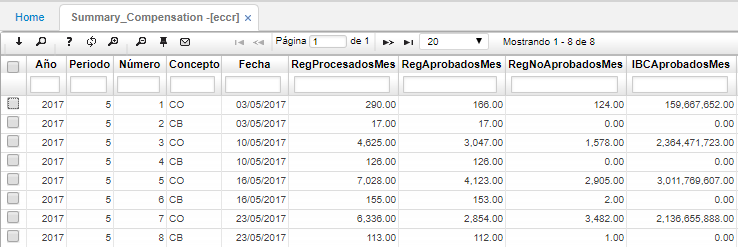
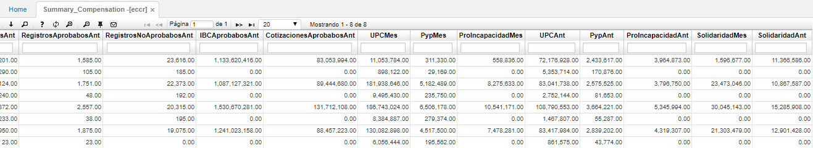

# Resumen de Compensación - ECCR

La aplicación ECCR muestra el resumen de las compensaciones totales procesadas, aprobadas o no aprobadas, realizadas en un periodo y año en específico.  

A continuación se pueden observar los registros procesados, aprobados y no aprobados por mes.

Al deslizar la ventana se puede más información de registros igualmente procesados, aprobados y no aprobados del mes anterior, cotizaciones aprobadas, entre otras.  

