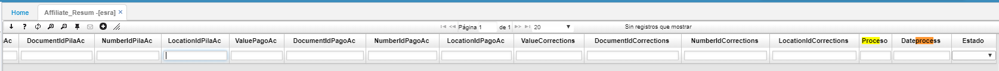

# ESRA - Resumen Afiliado

La opción ESRA es una aplicación únicamente de consulta que permite verificar el resumen de afiliación, pila, log, compensación de los usuarios.  

Consultamos por periodo y año.  

* Se adicionan estos campos con el fin de identificar con que proceso 2.5 o 2.8, y en que fecha fueron enviados dichos movimientos a la entidad respectiva.  
* 'Proceso' y 'Fecha Proceso'.

