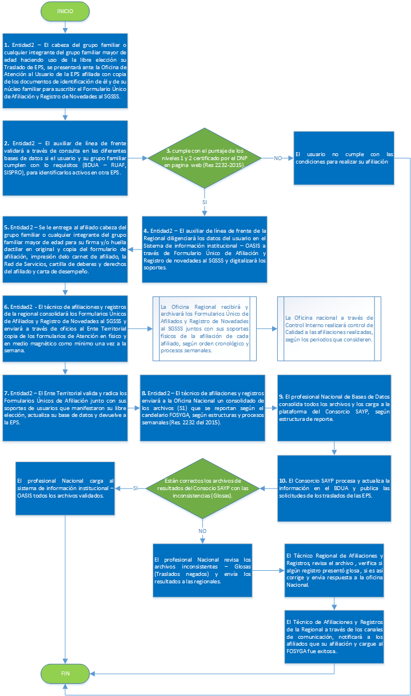

# Afiliaciones

En este submódulo, se realizan las operaciones relacionadas con la afiliación de los usuarios a la EPS, desde la consulta si cumple con los requisitos para afiliarse y afiliar a su grupo familiar, el régimen al que puede pertenecer, si no se encuentra afiliado a otra EPS, y cuando ya se tiene certeza de que se puede afiliar, realizar de manera digital la afiliación como tal; de la misma forma, también se puede hacer la gestión de traslados.  

Este submódulo está compuesto por:  

* Consultas        
* Aportantes    
* Afiliaciones      
* Procesos      
* Reportes    

Descarga el manual de afiliaciones [**AQUÍ**](http://docs.oasiscom.com/Operacion/is/salud/eafiliacion/manual%20afiliaciones.pdf)

