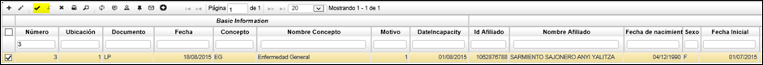

# Contratos de Empleador - ECNT

En la aplicación [ELIP – Liquidación de prestaciones](http://docs.oasiscom.com/Operacion/is/salud/eafiliacion/movadm/elip), se ingresa la información del número de documento del Afiliado, la fecha inicial, duración de incapacidad, fecha final que permite ingresar la fecha o dejarla nula para que el sistema la calcule tomando la fecha inicial y sumándole el dato de duración, se debe seleccionar el diagnóstico y la especialidad, en el campo tercero se debe ingresar el dato del documento a quien se va a pagar la incapacidad. 

**Nota:** El sistema valida que el dato ingresado en el campo Tercero tenga la relación laboral con el afiliado en la aplicación **ECNT – Contratos empleador,** si la tiene, toma el dato del archivo **PILA,** y si este no existe, presenta el mensaje de que el afiliado no tiene relación laboral.

Al darle guardar, la información queda almacenada y disponible para su respectiva consulta.

Y por último se realiza la confirmación del movimiento: 

