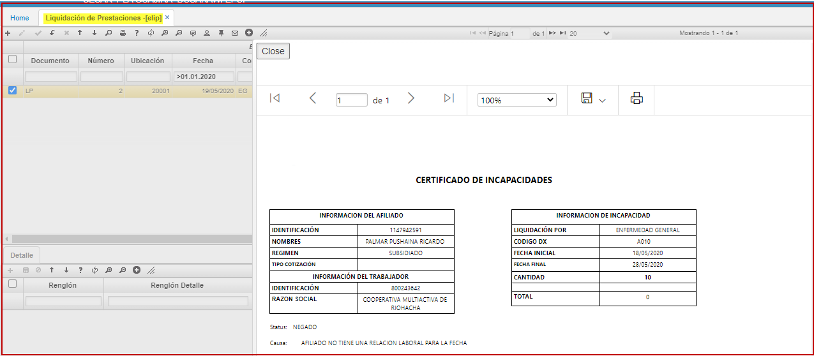

# Liquidación de Prestaciones - ELIP

En la aplicación **ELIP** – Liquidación de prestaciones, se ingresa la información del número de documento del Afiliado, la fecha inicial, duración de incapacidad, fecha final que permite ingresar la fecha o dejarla nula para que el sistema la calcule tomando la fecha inicial y sumándole el dato de duración, se debe seleccionar el diagnóstico y la especialidad, en el campo tercero se debe ingresar el dato del documento a quien se va a pagar la incapacidad.  

