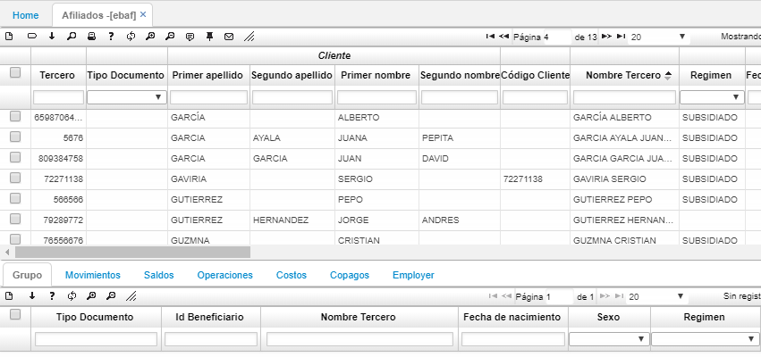

# EBAF - Afiliados

La aplicación EBAF permite consultar el registro de los afiliados por diferentes filtros de búsquedas, allí se puede ver todos los datos correspondientes a los afiliados.  

Cuando un registro, previamente ingresado por la aplicación [**EEMOV - Formulario de Afiliados WEB**](http://docs.oasiscom.com/Operacion/crm/portal/cliente/eemov), presenta algún inconveniente en sus datos, el responsable de los reportes de los archivos puede realizar una reversión de estado para la modificación necesaria.  

Igualmente, la aplicación nos permite visualizar toda la información de un afiliado a través de la siguiente vista dando click en el botón _Ver fila seleccionada_   ubicado en la barra de herramientras del maestro.  

En el detalle de la aplicación EBAF, la pestaña _Empleadores_ permite consultar el histórico de empleadores a los que el empleado se encontraba asociado.  

