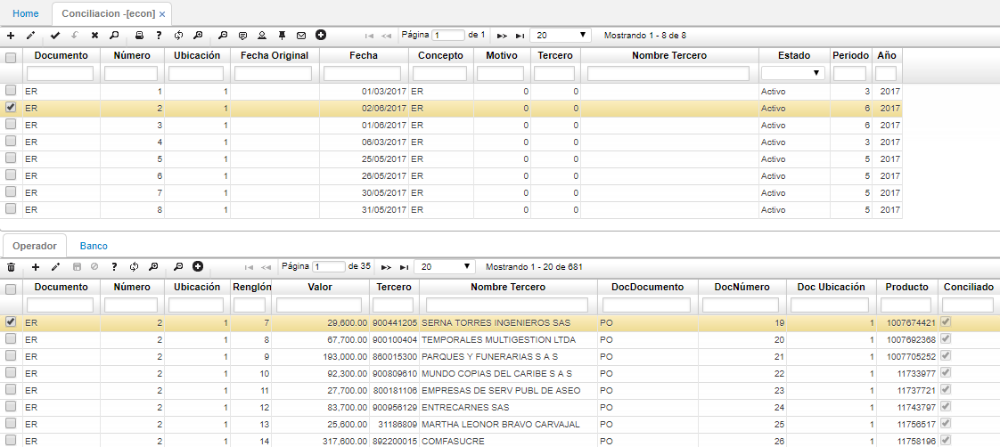
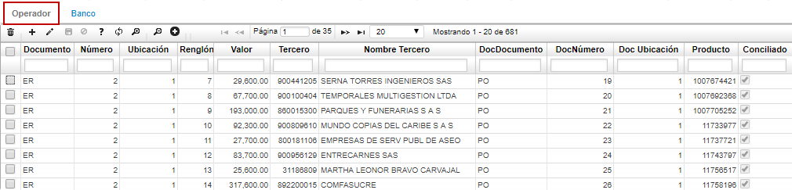
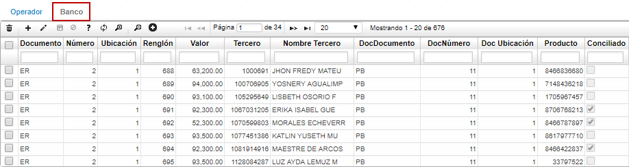
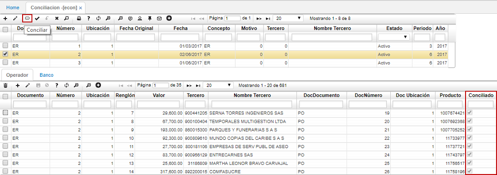
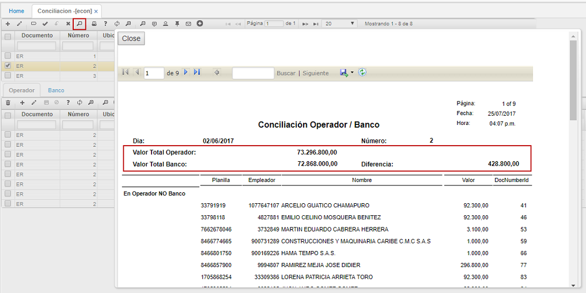

# Conciliación - ECON

La aplicación ECON permite visualizar la información de las conciliaciones de salud realizadas en dicha aplicación, es decir, la comparación de saldos de aportes de acuerdo a los valores cargados por el plano del operador y los valores del plano enviado por el banco.  

Dichos archivos planos son cargados por la aplicación [**BINT - Interfaces**](http://docs.oasiscom.com/Operacion/utility/barchi/bint#archivos-planos-de-salud) la cual a su vez, generará el documento **PO** para el archivo del Operador y el documento **PB** para el archivo plano enviado por el banco en la aplicación [**ELIQ- Liquidaciones**](http://docs.oasiscom.com/Operacion/is/salud/eafiliacion/movafi/eliq). (_Ver aplicaciones_)

En la pestaña **Operador** se puede ver el valor por cada aportante, el nombre del aportante, el número y documento con el cual se generó el aporte en la aplicación [**ELIQ- Liquidaciones**](http://docs.oasiscom.com/Operacion/is/salud/eafiliacion/movafi/eliq), el campo _Producto_ que correponde al número de la planilla, este número se encuentra en el detalle de la aplicación ELIQ y por último el campo _Conciliado_, el cual es marcado automáticamente por el sistema cuando al conciliar los valores del operador con los valores del banco coinciden.  

Al hacer el cargue del archivo plano del banco por la aplicación [**BINT - Interfaces**](http://docs.oasiscom.com/Operacion/utility/barchi/bint#archivos-planos-de-salud), se podrá ver la información en la pestaña del detalle **Banco**. 

Con los dos archivos cargados en la aplicación ECON, procedemos a conciliar la información dando click en el botón _Conciliar_  ubicado en la barra de herramientas del maestro.  

El sistema validará por cada renglón de la pestaña Operador y Banco que para cada aportante los valores sean iguales, de ser así activará el check tanto para la pestaña _Operador_ como para la pestaña _Banco_ si no coinciden el check no se activará.  

La aplicación cuenta con una vista previa en la cual se puede ver en tipo reporte las diferencias encontradas entre Operador y Banco. Para ello, damos click en el botón  ubicado en la barra de herramientas del maestro.  

