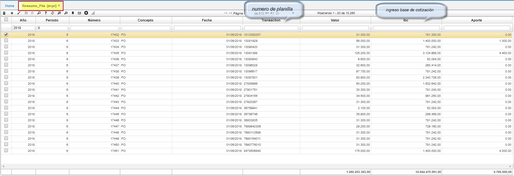
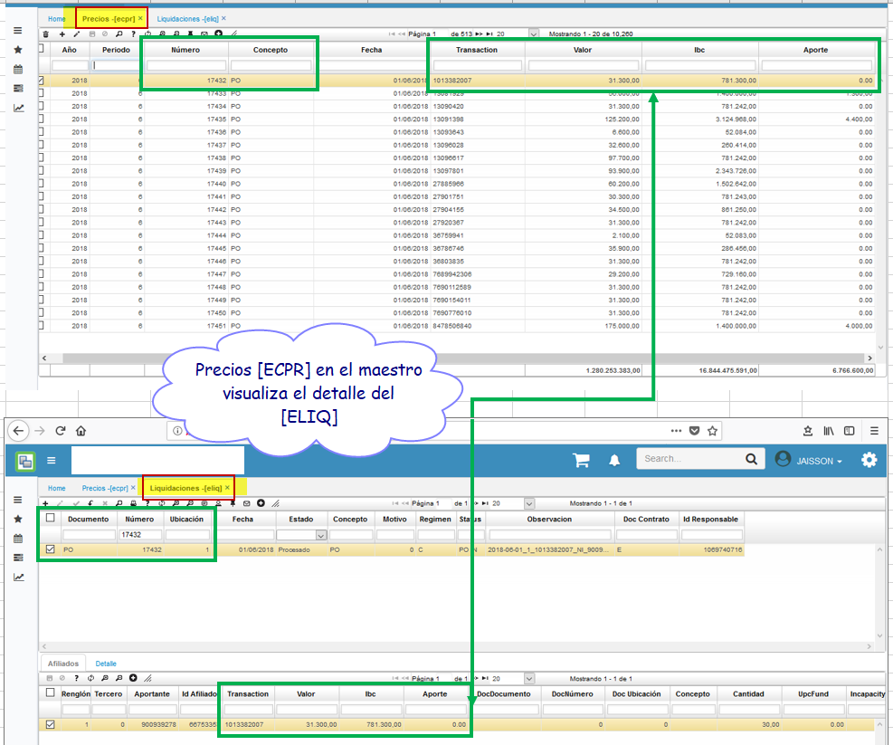

# ECPR - Precios.

La aplicación **[ECPR]** **PRECIOS** permite la visualización y el resumen de las pilas; se discrimina por año, periodo, concepto y numero de planilla entre otros.  

* En la opcion **ECPR**, en el maestro se visulizaran los campos del detalle del (ELIQ) Liquidaciones.  
* Consultamos primero en el **ECPR**, para validar que los datos suministrados,  sean coherentes con la opcion del ELIQ y buscamos la liquidación.  
* En este caso tomaremos el registro con el Numero 17432; como se ilustra  

