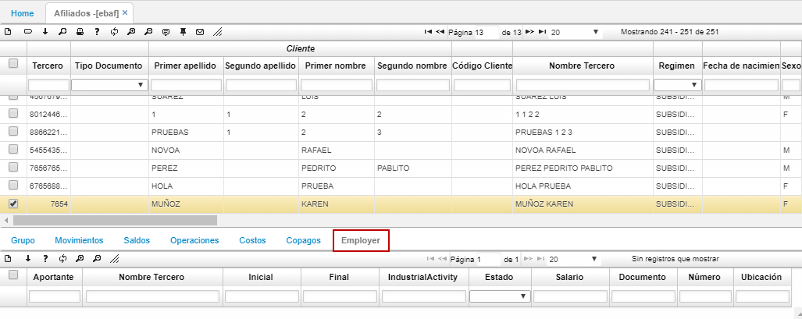

# ECPR - Precios.

La aplicación **[ECPR]** **PRECIOS** permite la visualización y el resumen de las pilas; se discrimina por año, periodo, concepto y numero de planilla entre otros.  

* En la opcion del ECPR, podemos ver a detalle la información de la opcion de Liquidaciones (ELIQ).  
* 

En el detalle de la aplicación EBAF, la pestaña _Empleadores_ permite consultar el histórico de empleadores a los que el empleado se encontraba asociado.  

