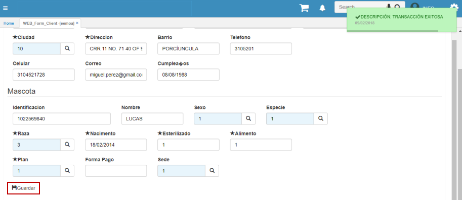

# EEMOA - Formulario Cliente Web

El formulario EEMOA permite realizar el proceso de afiliación de un paciente. Al diligenciar los campos y dar click en el botón _Guardar_ se habilitará un formulario en donde se ingresará la información del acudiente y el paciente.  

El sistema indicará en un mensaje de control el consecutivo con el cual se creó el documento que puede ser visualizado posteriormente en la aplicación **EMOA - Formulario Cliente**, a la vez que arroja el formulario para ingresar los datos.  

Ingresamos los datos del acudiente y el paciente en el formulario y guardamos. El sistema indicará que el proceso de afiliación ha sido realizado exitosamente.  

En caso de que ingrese un afiliado a la institución, dicho ingreso se realiza por la actual aplicación EEMOA, de llegase a realizar modificaciones a los datos contenidos en el formulario que automáticamente arrojará el sistema con los datos previos, dichos datos serán actualizados en la información básica del afiliado.  

En el ejemplo, actualizaremos la dirección y el barrio del afiliado en la aplicación EEMOA.  

Al guardar, los datos serán actualizados automáticamente al consultar por el número de formulario.  

