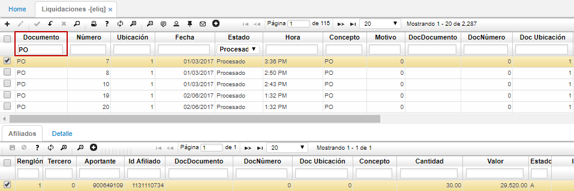

# Liquidaciones  -ELIQ

## [Archivos de Conciliación](http://docs.oasiscom.com/Operacion/is/salud/eafiliacion/movafi/eliq#archivos-de-conciliación)

La aplicación ELIQ permite ver la información de los archivos planos del operador y del banco cargados anteriormente en la aplicación [**BINT - Interfaces**](http://docs.oasiscom.com/Operacion/utility/barchi/bint#archivos-planos-de-salud). Al cargar los documentos en **BINT**, se crearán automáticamente en **ELIQ - Liquidaciones** los documentos _PO - Planilla Operador_ para el archivo del Operador y los documentos _PB - Pago Banco_ para el archivo plano enviado por el banco.  

Para el caso de los archivos planos del operador, se filtrará por el documento **PO**, en el maestro se puede ver la fecha de creación, el estado Procesado, el Id del responsable, el nombre del archivo cargado, entre otras características.  

En el detalle, se muestra la identificación del aportante, el afiliado, el valor del aporte, el número de planilla, entre otras características.  

Igualmente, para ver la información del archivo plano enviado por el banco se filtrará por documento **PB**, en el detalle también se puede ver la identificación del aportante y el valor del aporte, número de planilla, entre otra información.  

Validados los documentos en la aplicación **ELIQ - Liquidaciones**, ingresaremos a la aplicación [**ECON - Conciliación**](http://docs.oasiscom.com/Operacion/is/salud/eafiliacion/movafi/econ) a validar los documentos creados allí y a realizar la conciliación de salud.  