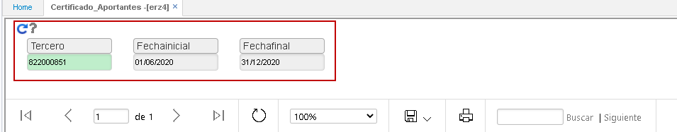
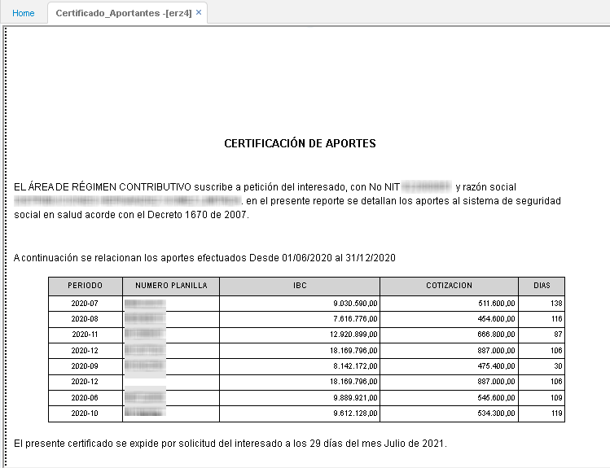

# Certificación de Aportes - ERZ4

El reporte ERZ4 nos permite generar un certificado de aportes por tercero filtrando por los siguientes campos:  

Dando click en el botón _Generar_ nos arrojará el siguiente certificado con los periodos de consulta, número de planilla, IBC, cotización y días.  

