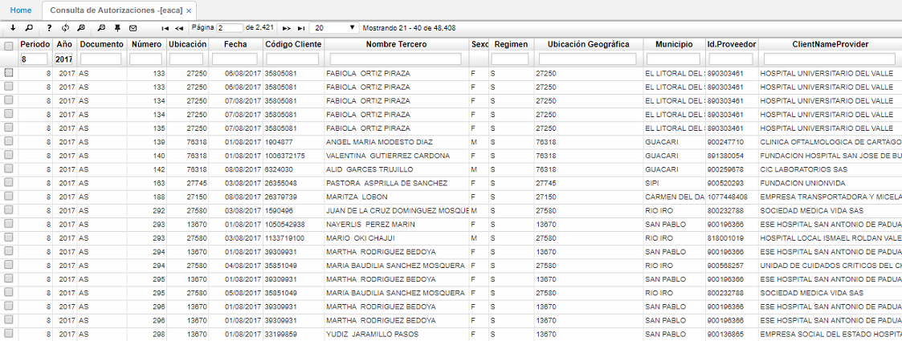
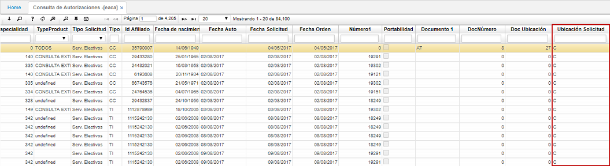
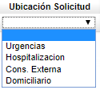

# EACA - Consulta de Autorizaciones

La aplicación EACA permite consultar las autorizaciones de salud previamente registradas en la aplicación [**EAUT - Autorizaciones**](http://docs.oasiscom.com/Operacion/is/salud/eautorizacion/movaut/eaut). Allí se consultará la información dando _Enter_ o filtrando por algunos campos.  

El último campo de la ventana _Ubicación solicitud_ permite identificar la ubicación desde donde se solicitó la autorización.  

**U:** Urgencias  
**H:** Hospitalización  
**C:** Consulta Externo  
**D:** Domiciliario  

