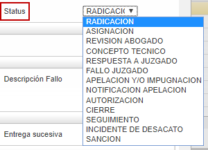
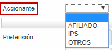
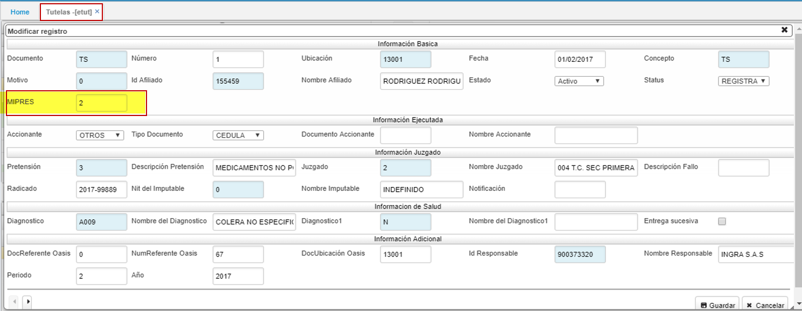
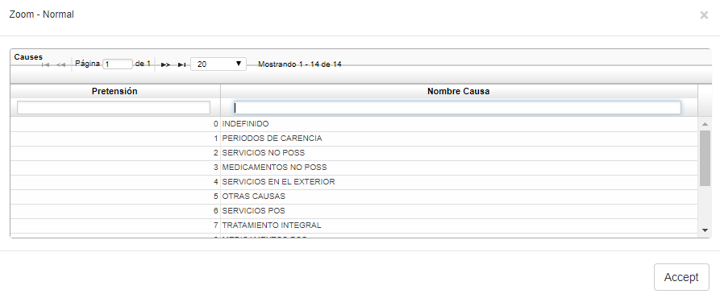
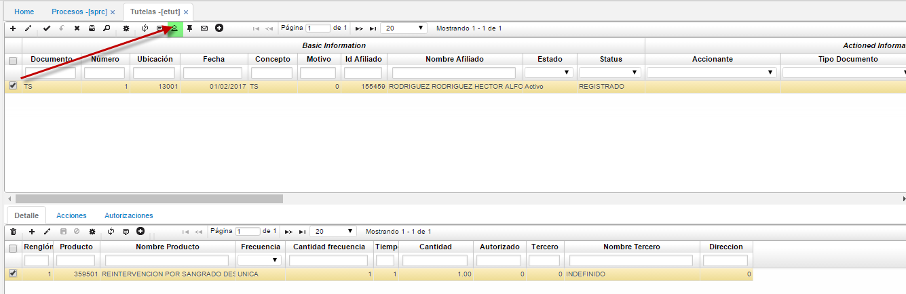
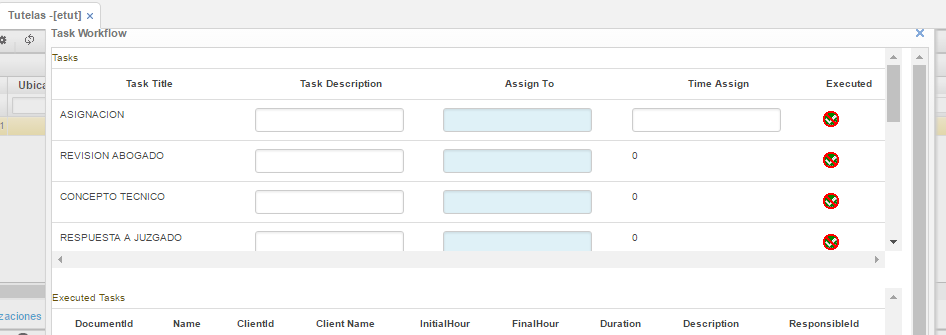
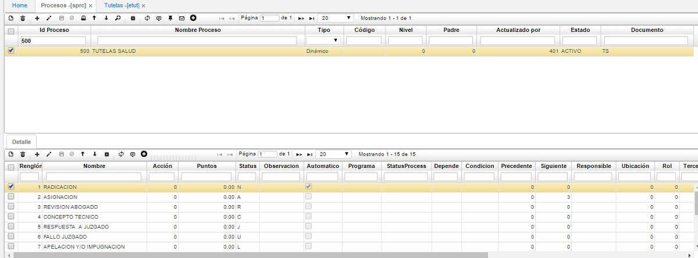
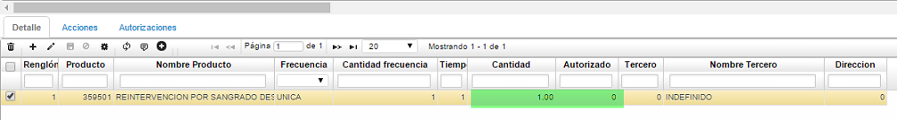

# TUTELAS

## Tutelas - ETUT

La aplicación **ETUT** permite llevar a cabo el registro de tutelas, el seguimiento y las autorizaciones correspondientes al proceso. El proceso inicia cuando el ente judicial indica a la entidad prestadora de servicios de salud sobre una tutela.

#### **Registro**

Para registrar una tutela dar click en el botón **+** que se encuentra en la barra de herramientas, se desplegará un nuevo formulario en donde se deben diligenciar los campos correspondientes.

**Documento:** seleccionar el documento correspondiente para tutelas. Los documentos son parametrizados en la aplicación [**BDOC - Documentos**](http://docs.oasiscom.com/Operacion/common/bsistema/bdoc).  
**Número:** el número de consecutivo será asignado automáticamente por el sistema.  
**Ubicación:** seleccionar la ubicación desde donde se registra la tutela.  
**Fecha Notificación:** indicar la fecha en la cual se realiza la notificación de la tutela.  
**Concepto:** seleccionar el concepto por el que se registra la tutela. Los conceptos son parametrizados en la aplicación [**BCON - Conceptos**](http://docs.oasiscom.com/Operacion/common/bsistema/bcon).  
**Motivo:** seleccionar del zoom el motivo de la tutela. Los motivos son parametrizados en la aplicación [**BMOT - Motivos**](http://docs.oasiscom.com/Operacion/common/bsistema/bmot).  
**Id Afiliado:** ingresar o seleccionar del zoom el número de identificación del afliado por el cual se realizó la tutela.  
**Estado:** el sistema automáticamente asignará el estado del registro de la tutela.  
**Status:** seleccionar de la lista desplegable, el status en el cual se encuentra la tutela.  

**Accionante:** seleccionar de la lista desplegable el accionante que interpuso la tutela.  

* En el formulario de las tutelas  **ETUT** se incluye el campo.  
MIPRES: código que permite a los profesionales de salud reportar la prescripción de tecnologías en salud no financiadas, con recursos de la UPC o servicios complementarios. como se ilustra.

**Tipo Documento:** seleccionar el tipo de documento del accionante.  
**Documento Accionante:** ingresar el número de identificación del accionante.  
**Nombre Accionante:** ingresar el nombre del accionante que interpone la tutela.  
**Pretensión:** seleccionar del zoom la razón por la cual se registra la tutela.  

**Descripción Pretensión:** al seleccionar anteriormente la pretensión, automáticamente se diligenciará este campo con el nombre de dicha pretensión.  
**Juzgado:** seleccionar del zoom el juzgado correspondiente a la tutela.  
**Nombre Juzgado:** al guardar el registro, el sistema diligenciará el nombre del juzgado seleccionado anteriormente.  
**Descripción Fallo:** hacer una breve descripción sobre el fallo de la tutela.  
**Radicado:** número de radicación de la tutela.  
**Diagnóstico:** seleccionar del zoom el diagnóstico médico por el cual se interpone la tutela.  
**Nombre Diagnóstico:** al guardar el registro, este campo se diligencia automáticamente.  

Diligenciados los campos, dar click en el botón **Guardar.**

En el maestro de la aplicación quedará registrada la nueva tutela.

#### **Seguimiento**

Para realizar seguimiento a una tutela, se hará uso de la funcionalidad _WorkFlow_ que se encuentra en la barra de herramientas y se identifica con el botón .

Este ícono despliega una ventana en donde se pueden asignar los procesos por los que pasará la tutela.

En la ventana anterior, se realiza una descripción por cada actividad por la cual pasará la tutela, se asigna el responsable de cada actividad digitando el número de cédula o seleccionandolo del zoom y finalmente, cuando se ejecute la actividad se debe dar click en el botón **Ejecutado** para que pase a la siguiente.
Las actividades por las cuales pasará la tutela son parametrizables en la aplicación **SPRC - Procesos**.

#### **Autorización**

Cuando la tutela se encuentre en la última actividad en la cual se autorizan los productos de la misma, se deben ingresar dichos productos en el detalle de la aplicación ETUT - Tutelas teniendo en cuenta los campos _cantidad_ y _autorizado._

Finalmente, cuando se procese la tutela desde el botón **confirmar** ubicado en la barra de herramientas del maestro, se generarán automáticamente las autorizaciones que sean necesarias en la aplicación **EAUT - Autorizaciones**.
