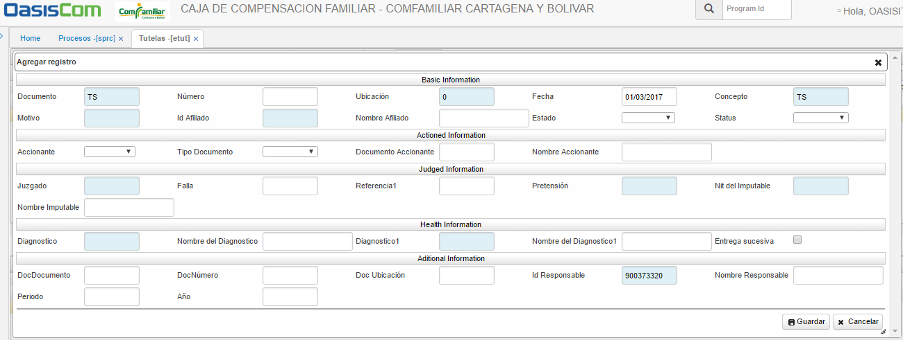
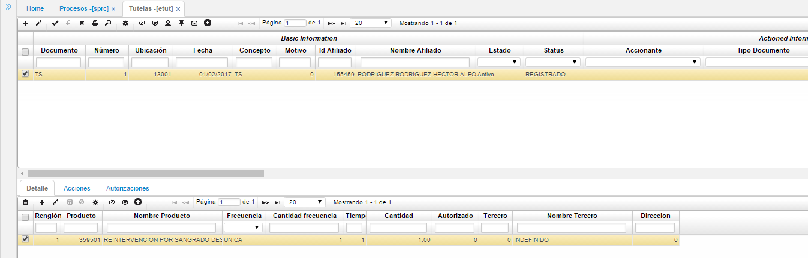

# TUTELAS

## Tutelas - ETUT

La aplicación **ETUT** permite llevar a cabo el registro de tutelas, el seguimiento y las autorizaciones correspondientes al proceso.
El proceso inicia cuando el ente judicial indica a la entidad prestadora de servicios de salud sobre una tutela. 

###**Registro**

Para registrar una tutela dar click en el botón **+** que se encuentra en la barra de herramientas, se desplegará un nuevo formulario en donde se deben diligenciar los campos correspondientes.

Diligenciados los campos, dar click en el botón **Guardar.**

En el maestro de la aplicación quedará registrada la nueva tutela.

###**Seguimiento**

Para realizar seguimiento a una tutela, se hará uso de la funcionalidad _WorkFlow_ que se encuentra en la barra de herramientas y se identifica con el botón 

Este ícono despliega una ventana donde se pueden asignar los procesos por los que pasará la tutela.

En la ventana anterior, se realiza una descripción por cada actividad por la cual pasará la tutela, se asigna el responsable de cada actividad digitando el número de cédula o seleccionandolo del zoom y finalmente, cuando se ejecute la actividad se debe dar click en el botón **Ejecutado** para que pase a la siguiente.
Las actividades por las cuales pasará la tutela son parametrizables en la aplicación **SPRC**.

###**Autorización**

Cuando la tutela se encuentre en la última actividad en la cual se autorizan los productos de la misma, se deben ingresar dichos productos en el detalle de la aplicación ETUT - Tutelas teniendo en cuenta los campos _cantidad_ y _autorizado._

Finalmente, cuando se procese la tutela desde el botón **confirmar** ubicado en la barra de herramientas del maestro, se generarán automáticamente las autorizaciones que sean necesarias en la aplicación EAUT.
