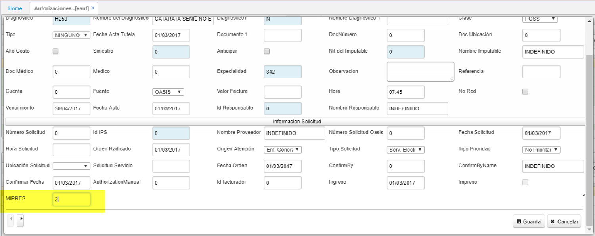

# EAUT - Autorizaciones

## Autorizaciones - EAUT

La aplicación **EAUT** permite llevar a cabo el registro de Autorizaciones, el seguimiento correspondientes al proceso. 

#### **Registro**
Para registrar una autorizacion dar click en el botón **+** que se encuentra en la barra de herramientas, se desplegará un nuevo formulario en donde se deben diligenciar los campos correspondientes.  

**Documento:** seleccionar el documento correspondiente para autorizaciones. Los documentos son parametrizados en la aplicación [**BDOC - Documentos**](http://docs.oasiscom.com/Operacion/common/bsistema/bdoc).  
**Número:** el número de consecutivo será asignado automáticamente por el sistema.  
**Ubicación:** seleccionar la ubicación desde donde se registra la autorizacion.  
**Diagnostico:** .  
**Nombre del Diagnostico:** .  
**Clase:** 
**Tipo:** 
**Fecha Acta Tutela:** 
**Doc Medico:** 
**Medico:** 
**Especialidad:** 
**Cuenta:** 
**Fuente:** 

* En el formulario de las Autorizaciones  **EAUT** se incluye el campo.  
MIPRES: código que permite a los profesionales de salud reportar la prescripción de tecnologías en salud no financiadas, con recursos de la UPC o servicios complementarios. como se ilustra.

