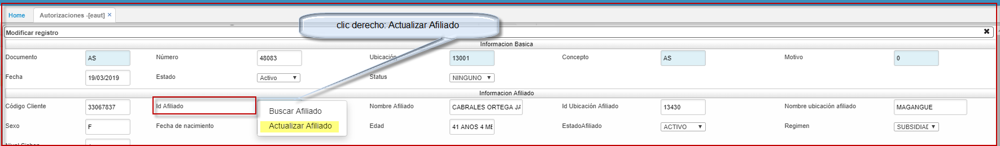

# EAUT - Autorizaciones  

## Autorizaciones - EAUT  

La aplicación **EAUT** permite llevar a cabo el registro de Autorizaciones de salud y el seguimiento correspondientes al proceso.  

#### **Registro**
Para registrar una autorizacion dar click en el botón **+** que se encuentra en la barra de herramientas, se desplegará un nuevo formulario en donde se deben diligenciar los campos correspondientes.  

  

**Documento:** seleccionar el documento correspondiente para autorizaciones. Los documentos son parametrizados en la aplicación [**BDOC - Documentos**](http://docs.oasiscom.com/Operacion/common/bsistema/bdoc).  
**Número:** el número de consecutivo será asignado automáticamente por el sistema.  
**Ubicación:** seleccionar la ubicación desde donde se registra la autorizacion.  
**Id_Afiliado:** parametrizacion realizada en BTER, posee zoom de busqueda al dar doble clic.  
**Diagnostico:** .  criterio medico.  
**Nombre del Diagnostico:** Nombre especifico del tipo de diagnostico.  
**Clase:** Clase de cubrimiento que se le dará al diagnostico emitido.  
**Tipo:**  
**Fecha Acta Tutela:** si aplica.  
**Doc Medico:** documento del tratante.  
**Medico:**  nombres.  
**Especialidad:**  del servicio parametrizado en BBES.  
**Cuenta:**  
**Fuente:**  
**Fecha Factura**  campo tipo consulta, no editable.  

En el formulario de las Autorizaciones  **EAUT** se incluye el campo.  
**MIPRES:** código que permite a los profesionales de salud reportar la prescripción de tecnologías en salud no financiadas, con recursos de la UPC o servicios complementarios. como se ilustra resaltado.  

* Para actualizar los datos del afiliado se procede a insertar un nuevo registro en la autorizacion **EAUT**, clic derecho sobre el campo actualizar afiliado.  

  
* Abre este submenu:
	Donde siempre se deben actualizar los campos: dirección, teléfono, celular, email, barrio.  
    
  

##PROCESO DE CONSUMO DE SERVICIOS MIPRES.  
Involucran funcionalidades como:  
**Direccionamiento:** Este proceso realiza la captura de información en que EPS genera el direccionamiento? a que proveedor? (Droguería, Etc.); para la entrega de medicamentos entre otros a los pacientes.  
**Anulación Direccionamiento:** Este proceso simplemente anula la información brindada en el direccionamiento.  

* Ambos procesos anteriores se realizan por el programa **EAUT ( AUTORIZACIONES).**  

A este nivel se puede realizar el proceso de direccionamiento ya que es donde se tiene conocimiento del número de entregas en cuanto a medicamentos para un paciente.  
  

* Al darle clic sobre el botón de direccionamiento se abre una ventana modal, la cual solicita los datos a ingresar.  

  

Se solicita los datos el “Nro. de entrega”, y “sub entrega” realizado al paciente.	

