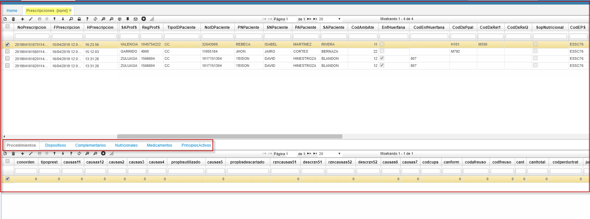
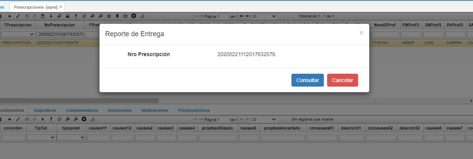

---  
layout: default  
title: Prescripciones 
permalink: /Operacion/is/salud/eautorizacion/movaut/epre  
editable: si  
---  

# EPRE- Prescripciones   

## Prescripciones  - EPRE  

Aplicación **EPRE**  extrae la información de las prescripciones originadas de la plataforma **MIPRES**, con los procedimientos, dispositivos, medicamentos, complementarios, principios activos, nutricionales que intervienen en el proceso de salud.  

 

Definicion **MIPRES:** código que permite a los profesionales de salud reportar la prescripción de tecnologías en salud no financiadas, con recursos de la UPC o servicios complementarios. como se ilustra resaltado.  

Creación de botón para consumo reporte de entrega por número de prescripción, proceso MIPRES.  

  
**Boton Consultar:** Se realiza mediante OasisCom los siguientes procesos.  
**Pre-Validación:** Este proceso se realiza mediante el procedimiento almacenado p_Mipres.  
**Consumo de Servicio:** Este proceso realiza el consumo de la plataforma mipres.  
**Proceso Confirmación:** Este proceso notificará la respuesta obtenida a OasisCom sobre el mismo Procedimiento Almacenado p_Mipres  

  

Sobre el usuario final se muestra la respuesta obtenida del servicio.  

  

Se muestra información del servicio sobre plataforma MIPRES.  

  

