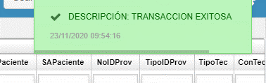

---  
layout: default  
title: Prescripciones 
permalink: /Operacion/is/salud/eautorizacion/movaut/epre  
editable: si  
---  

# EPRE- Prescripciones   

## Prescripciones  - EPRE  

Aplicación **EPRE**  extrae la información de las prescripciones originadas de la plataforma **MIPRES**, con los procedimientos, dispositivos, medicamentos, complementarios, principios activos, nutricionales que intervienen en el proceso de salud.  

 

Definicion **MIPRES:** código que permite a los profesionales de salud reportar la prescripción de tecnologías en salud no financiadas, con recursos de la UPC o servicios complementarios. como se ilustra resaltado.  

Creación de botón para consumo reporte de entrega por número de prescripción, proceso MIPRES.  

  
**Boton Consultar:** Se realiza mediante OasisCom los siguientes procesos.  
**Pre-Validación:** Este proceso se realiza mediante el procedimiento almacenado p_Mipres.  
**Consumo de Servicio:** Este proceso realiza el consumo de la plataforma mipres.  
**Proceso Confirmación:** Este proceso notificará la respuesta obtenida a OasisCom sobre el mismo Procedimiento Almacenado p_Mipres  

  

Sobre el usuario final se muestra la respuesta obtenida del servicio.  

  

Se muestra información del servicio sobre plataforma MIPRES.  

  

# Seguimiento de Prescripciones.  

Desde **EPRE**, se  visualiza por parte de la EPS el seguimiento actual de una **Prescripción.**  
Se crea nuevo Tab – seguimiento, al programa **EPRE.**  
Esta nueva pestaña mostrara la información solicitada:  
**Direccionamiento:** Proceso realizado por la EPS.    
**Programación:** Proceso realizado por el prestador.  
**Entrega:** Proceso realizado por el prestador.  
**Reporte Entrega:** Proceso realizado por el prestador.  
**Facturación:** Proceso realizado por el prestador.  
**Suministro:** Proceso realizado por la EPS.  

  

De esta manera el usuario de la EPS tendrá como validar en que proceso se encuentra actualmente la Prescripción.    
El programa **EEPRE,** está orientado al usuario de la Ips/Prestador, y al realizar la sincronización se alimenta la información sobre OASISCOM,  para que la EPS tenga conocimiento en qué momento realizar la finalización del ciclo que sería el envió de suministro sobre cada direccionamiento con todas las etapas realizadas.  
Se resalta el botón de sincronización.  

  

Se selecciona todos los direccionamientos realizados por la prescripción.  
Los procesos realizados por la IPS ya sean algunos de los mencionados anteriormente.  
Por ser un proceso que solo lo puede consultar la IPS/Prestador.  
Se debe ingresar el token base de la IPS/Prestador.  
Le damos en el botón de sincronizar.  

  

Esperamos a que termine el proceso de sincronización.  

  
Consultamos nuevamente el seguimiento de la prescripción.  
Se puede validar que se alimenta de manera correcta la información de la prescripción.  

  

 # Envió de Suministro.  

Para el envío de suministro, la cual viene siendo el proceso final para cerrar el ciclo sobre el servicio MIPRES.  
Para este proceso que se realiza por la EPS.  
Se ingresa al programa **EPRE. **

Se visualiza el botón configurado sobre el programa **EPRE.**  

  

Al darle sobre el botón, se visualiza el siguiente resumen.  

Se muestra mensaje informativo de cantidad de registros a ejecutar para el proceso actual.  

