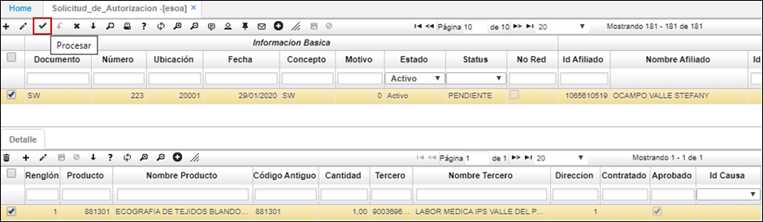

--- 

layout: default  
title: Solicitud de Autorización.  
permalink:/Operacion/is/salud/eautorizacion/movaut/esoa  
editable: si  

---  

# ESOA- Solicitud de Autorización.  

+ [Solicitud de Autorizaciones](http://docs.oasiscom.com/Operacion/is/salud/eautorizacion/movaut/esoa#solicitud-de-autorizaciones)
+ [Detalle aplicación ESOA Solicitud Autorizaciones](http://docs.oasiscom.com/Operacion/is/salud/eautorizacion/movaut/esoa#detalle-aplicación-esoa-solicitud-autorizaciones)

Se documenta, como está el proceso de la solicitud de autorización.  
Existe el programa [**EESOA**]() que actualmente el diligenciado por la **IPS (externo)**, en la que solicitan la autorización a la **EPS.**  

El proceso que realiza la **EPS** por el programa [**ESOA**](http://docs.oasiscom.com/Operacion/is/salud/eautorizacion/movaut/esoa#solicitud-de-autorizaciones) es de aprobar esas solicitudes; al darle procesar, si se aprueba la solicitud, la aplicación realiza automáticamente la autorización.  

El usuario actualmente debería de ir a la aplicación del [**EAUT**]() consultar y generar la impresión.  
Entonces por ser un tema de agilizar el proceso se optó por darle opción de poder imprimir la autorización.

Por temas de permisos adicionalmente se optó el generar este botón de impresión.
Una vez procesado queda referenciado el documento de la solicitud con la autorización generada.
Por consiguiente, al darle imprimir se realiza el mismo proceso que imprimir desde el programa **EAUT.**  

 

## [Solicitud de Autorizaciones](http://docs.oasiscom.com/Operacion/is/salud/eautorizacion/movaut/esoa#solicitud-de-autorizaciones)

Las solicitudes de autorizaciones pueden ser creadas por la *IPS* o prestador de servicio por medio de la aplicación *EESOA – Solicitud de Autorización* o a nivel interno la EPS la puede crear en la aplicación *ESOA – Solicitud de Autorización.*

A continuación, explicaremos cómo crear una solicitud de autorización a nivel interno, es decir, por parte de la EPS en la aplicación ESOA.

Ingresamos a la aplicación ESOA y creamos un nuevo registro.

 

Ingresamos documento y concepto *SW – Solicitud autorización* y la ubicación desde donde se realiza la solicitud.

Seguidamente, en la sección *“Información Afiliado”,* en el campo **“Id Afiliado”,** seleccionamos del zoom el afiliado al cual se le está gestionando la solicitud de la autorización, los siguientes campos se diligenciarán automáticamente.

 

En la sección *“Información Solicitud”* ingresaremos los datos de la IPS que solicita la autorización, en caso de que la IPS haya realizado la solicitud de autorización por el EESOA, la información en estos campos se verá reflejada. En caso de que la EPS realice la solicitud deberá ingresar los datos.

Seleccionamos del zoom **“Id IPS”,** la IPS que solicita la autorización del servicio, del campo **“Dirección”** seleccionamos la sede de la IPS que la solicita, indicamos la ubicación de la solicitud, el código del servicio que se desea autorizar, el origen de atención (Enf. General, Enf. Profesional, Acc. Trabajo, Acc. Tránsito, Ev. Catastróficos), indicar el tipo de solicitud (Post. A Urgencias, Serv. Electivos, Serv. Adicionales), tipo de prioridad y marcaremos el flag *“Alto Costo”* en caso tal de que el servicio a autorizar sea de alto costo, esto deberá estar justificado o relacionado a un siniestro.

 

La sección de *“Información Tutela”* estará diligenciada en caso tal de que el afiliado tenga una tutela activa con la EPS y es a nivel informativo.

La sección de *“Información Adicional”* se debe diligenciar con uno o más diagnósticos del afiliado, así como se debe indicar el nombre y especialización del médico que realiza dichos diagnósticos.

 

Guardamos el registro y a continuación adjuntamos a la solicitud la historia clínica del afiliado. (La historia clínica la debe adjuntar el prestador de servicios *“IPS”*).

 

 

## [Detalle aplicación ESOA Solicitud Autorizaciones](http://docs.oasiscom.com/Operacion/is/salud/eautorizacion/movaut/esoa#detalle-aplicación-esoa–solicitud-autorizaciones)

Continuando con la solicitud, en el detalle de la aplicación **ESOA** debemos ingresar el servicio que se requiere autorizar. Ingresamos un nuevo renglón y seleccionamos el producto a solicitar en la autorización, la cantidad del producto y en el campo *“Tercero”* ingresamos la *IPS* a la cual se le autoriza la prestación del servicio.

 

En el renglón del detalle, el usuario de la *EPS* debe validar los datos registrados en la solicitud de autorización y en caso de que efectivamente se vaya a autorizar el servicio, debe activar el Flag de **“Aprobado”** y procesar la solicitud desde el maestro.

Una vez procesada la solicitud, se generará la autorización en la aplicación **EAUT- Autorizaciones** en estado *“Procesado”.*

 

En el detalle de la aplicación **ESOA – Solicitud de Autorizaciones** se puede ver en los campos *“Doc Autorización” y “Número Autorización”* el documento y número de consecutivo con el cual se creó la autorización en la aplicación EAUT. 

 

Igualmente, la aplicación **ESOA – Solicitud de Autorizaciones** permite imprimir, en caso de que sea aprobada por la *EPS,* la autorización generada anteriormente desde la barra de herramientas con el botón , si aún no está aprobada, arrojará un mensaje emergente.

 

 

