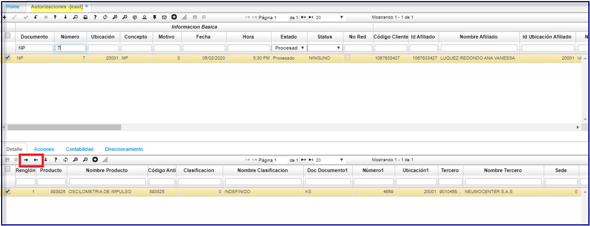

# EAUT - Solicitudes  

## Solicitudes - ESOL  

El servicio **MIPRES** de junta de profesionales por parte de la IPS, es consultado por la EPS para realizar el proceso de direccionamiento o no direccionamiento.	
Esta junta es en algunos casos necesaria realizarla, ya que según las especificaciones del medico se procede a realizar una junta de especialistas por parte de la IPS para el proceso con el paciente.	 
Esta decision reportada por la IPS es necesaria consultarla, ya que como se explica es necesaria para reportar la debida información a MIPRES.	
Para realizar el proceso en oasis:	
Ingresamos al **ESOL**  (solicitud de autorización).  
Se personaliza el proceso a realizar por este boton la cual sera la consulta sobre el servicio MIPRES de junta de profesionales	 
Se manejara un **STATUS** en pendiente de junta sobre los que se deban realizar este proceso.  

  

Al darle al boton:  
Se muestra el registro de la prescripcion.  
Realizamos la confirmación dando en el boton aceptar:  

  

**Documento:** seleccionar el documento correspondiente para autorizaciones. Los documentos son parametrizados en la aplicación [**BDOC - Documentos**](http://docs.oasiscom.com/Operacion/common/bsistema/bdoc).  
**Número:** el número de consecutivo será asignado automáticamente por el sistema.  
**Ubicación:** seleccionar la ubicación desde donde se registra la autorizacion.  
**Id_Afiliado:** parametrizacion realizada en BTER, posee zoom de busqueda al dar doble clic.  
**Diagnostico:** .  criterio medico.  
**Nombre del Diagnostico:** Nombre especifico del tipo de diagnostico.  
**Clase:** Clase de cubrimiento que se le dará al diagnostico emitido.  
**Tipo:**  
**Fecha Acta Tutela:** si aplica.  
**Doc Medico:** documento del tratante.  
**Medico:**  nombres.  
**Especialidad:**  del servicio parametrizado en BBES.  
**Cuenta:**  
**Fuente:**  
**Fecha Factura**  campo tipo consulta, no editable.  

En el formulario de las Autorizaciones  **EAUT** se incluye el campo.  
**MIPRES:** código que permite a los profesionales de salud reportar la prescripción de tecnologías en salud no financiadas, con recursos de la UPC o servicios complementarios. como se ilustra resaltado.  

* Para actualizar los datos del afiliado se procede a insertar un nuevo registro en la autorizacion **EAUT**, clic derecho sobre el campo actualizar afiliado.  

  
* Abre este submenu:  
	Donde siempre se deben actualizar los campos: dirección, teléfono, celular, email, barrio.  
    
  

## PROCESO DE CONSUMO DE SERVICIOS MIPRES. ##  
Involucran funcionalidades como:  
**Direccionamiento:** Este proceso realiza la captura de información en que EPS genera el direccionamiento? a que proveedor? (Droguería, Etc.); para la entrega de medicamentos entre otros a los pacientes.  
**Anulación Direccionamiento:** Este proceso simplemente anula la información brindada en el direccionamiento.  

* Los procesos anteriores se realizan por el programa **EAUT ( AUTORIZACIONES).**  

A este nivel se puede realizar el proceso de direccionamiento ya que es donde se tiene conocimiento del número de entregas en cuanto a medicamentos para un paciente.  

Se muestra en el programa EAUT los botones ahora sobre el detalle.  
Este cambio debido a que una autorización se puede extender a mas de un servicio y cada uno a proveedores diferentes para realizar la atencion al paciente.  
  

* Al darle clic sobre el botón de direccionamiento se abre una ventana modal; se da opcion a que el usuario pueda modificar algunos datos sobre el formulario.  

  

* Posterior se e solicita los datos el “Nro. de entrega”, y “sub entrega” realizado al paciente.	 

**Token:** Se solicita el token ya que la EPS adquiere un token habilitado por 24 horas, este token generado desde un sitio web externo del Min. de Salud.  

Una vez ingresemos los datos se da aceptar.  

**PROCESO INTERNO QUE GENERA OASIS:**	  

**Pre-Validación:** Este proceso realizara la validación necesaria sobre los datos antes de que se envíen los datos.  
**Consumo de Servicio:** Este proceso tomará los datos solicitados por el servicio desde OasisCom. Se genera la petición de actualización sobre el servicio MIPRES.   
**Proceso Confirmación:** Este proceso notificará la respuesta a OasisCom para la captura de referenciación.  

**EL PROCESO DE ANULACIÓN ES DE LA SIGUIENTE MANERA.**  

Este proceso solo requiere el token.  
Y al ejecutarlo se genera el mismo proceso indicado en el direccionamiento.  

  

**No Direccionamiento:** Este proceso es contradictorio al de "direccionamiento", este proceso le indica la causa por la que la EPS indica que NO se realizara el NO direccionamiento al proveedor ( Droguería u otro medio).  
**Anulación No Direccionamiento:** Anula el proceso de No direccionamiento.  

* Ambos procesos anteriores se realizan por el programa **ESOL (SOLICITUDES).**  

Todos los procesos piden token por el motivo indicado.  

Solo el proceso de direccionamiento pide los campos Nro. entrega y Nro. sub entrega.  

