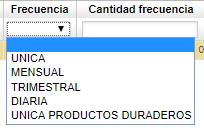

# Actas Comité

La aplicación _EACT - Actas de Comité_, refleja las solicitudes de medicamentos o procedimientos que se realizaron mediente la aplicación [**EESOL**]() por un usuario y que posteriormente la EPS confirmó en la aplicación [**ESOL - Solicitudes**]() con el fin de que sea revisada por el Comité Técnico Científico de la EPS el cual estudiará si aprueba o no la solicitud.  

En el maestro se generará un documento _YY_ correspondiente a _Actas de Comité_, consultaremos en la aplicación por el _Id del Afiliado_ y en el detalle se podrán observar los productos o servicios solicitados para el paciente.  

En el detalle se encuentra el servicio o medicamento que solicitan al paciente. Este detalle cuenta con el campo _Frecuencia_, del cual sale una lista desplegable con las siguientes opciones:

El anterior campo hace refencia a la frecuencia con el que será entregado el medicamento o la frecuencia con la que se realizará el servicio, según corresponda.  

