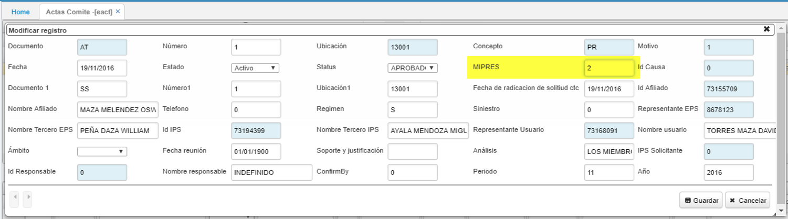

# Actas Comité

La aplicación _EACT - Actas de Comité_, refleja las solicitudes de medicamentos o procedimientos que se realizaron mediente la aplicación [**EESOL - Aplicación WEB**]() por un usuario y que posteriormente la EPS confirmó en la aplicación [**ESOL - Solicitudes**]() con el fin de que sea revisada por el Comité Técnico Científico de la EPS el cual estudiará si aprueba o no la solicitud.  

En el maestro se generará un documento correspondiente a _Actas de Comité_, consultaremos en la aplicación por el _Id del Afiliado_ y en el detalle se podrán observar los productos o servicios solicitados para el paciente.  

* En el formulario de Actas de Comite  **_EACT** se incluye el campo.  
MIPRES: código que permite a los profesionales de salud reportar la prescripción de tecnologías en salud no financiadas, con recursos de la UPC o servicios complementarios. como se ilustra.

En el detalle se encuentra el servicio o medicamento que solicitan al paciente. Este detalle cuenta con el campo _Frecuencia_, del cual sale una lista desplegable con las siguientes opciones:

El anterior campo hace refencia a la frecuencia con el que será entregado el medicamento o la frecuencia con la que se realizará el servicio, según corresponda.  

La opción _Única Productos Duraderos_ permite hallar los días de tratamiento.  

Si el Comité Técnico Científico de la EPS aprueba la solicitud, se deberá procesar el documento dando click en el botón de la barra de herramientas _Procesar_ .  

Procesado el documento, el sistema mostrará un mensaje indicando que la transacción fue exitosa y el documento pasará a estado _Procesado_.

