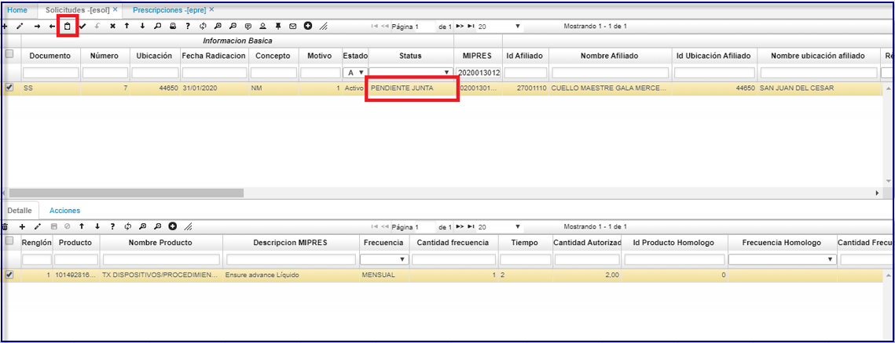
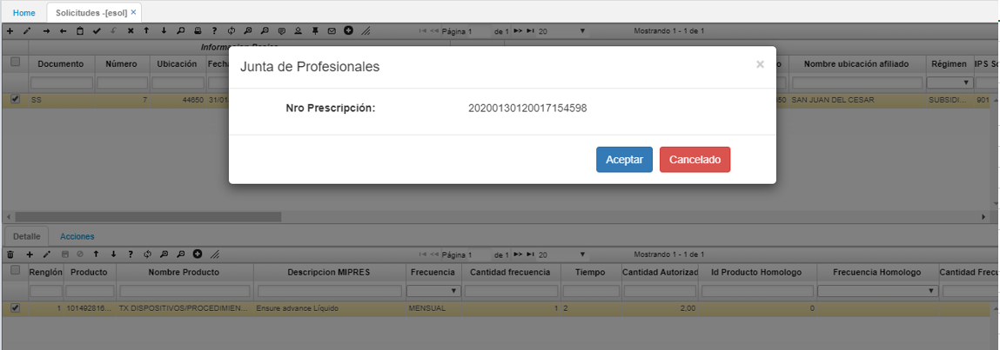
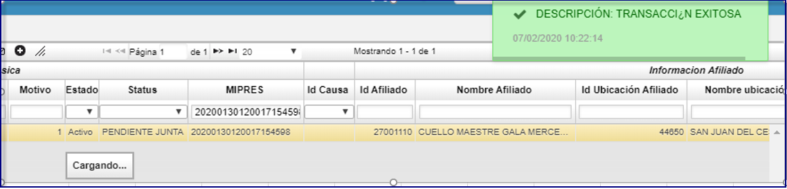
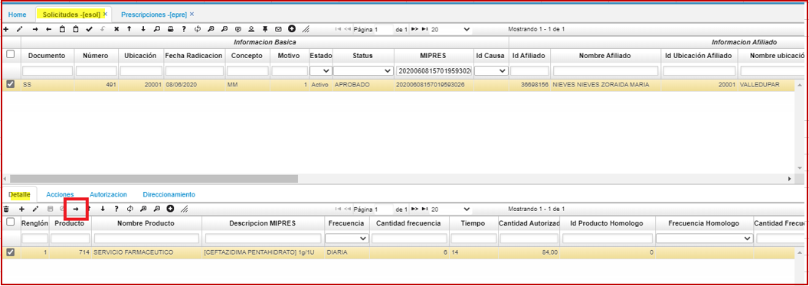
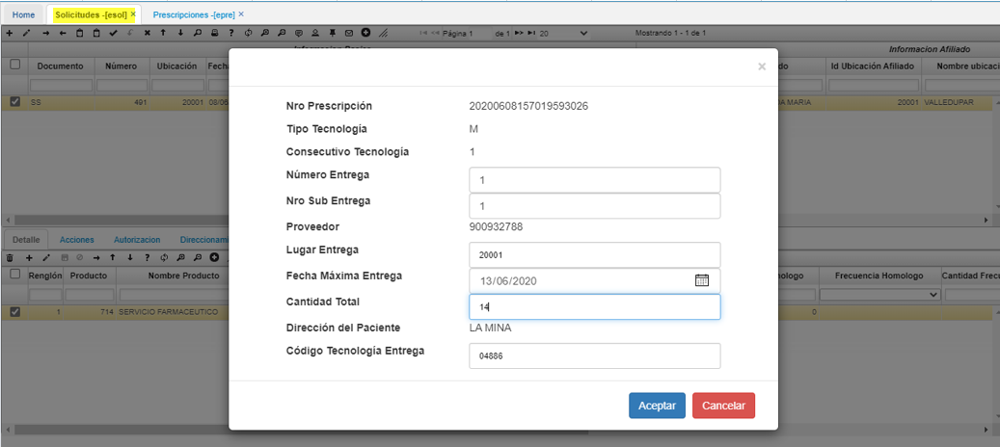
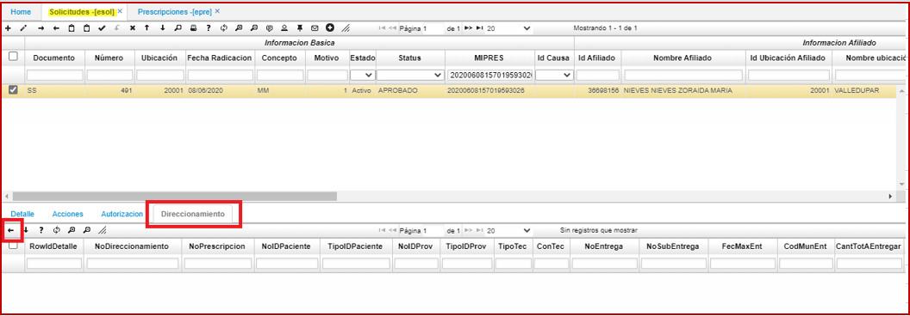

# ESOL - Solicitudes  

## Solicitudes - ESOL  

* Adecuación sobre el proceso MIPRES para el consumo de junta de profesionales, se crea nuevo boton con nuevo tipo de operación para este proceso, en la opcion **ESOL.**  

El servicio **MIPRES** de junta de profesionales por parte de la IPS, es consultado por la EPS para realizar el proceso de direccionamiento o no direccionamiento.	
Esta junta es en algunos casos necesaria realizarla, ya que según las especificaciones del medico se procede a realizar una junta de especialistas por parte de la IPS para el proceso con el paciente.	 
Esta decision reportada por la IPS es necesaria consultarla, ya que como se explica es necesaria para reportar la debida información a **MIPRES.**	
Para realizar el proceso en oasis:	
Ingresamos al **ESOL**  (solicitud de autorización).  
Se personaliza el proceso a realizar por este boton la cual sera la consulta sobre el servicio MIPRES de junta de profesionales	 
Se manejara un **STATUS** en pendiente de junta sobre los que se deban realizar este proceso.  

  

Al darle al boton:  
Se muestra el registro de la prescripcion.  
Realizamos la confirmación dando en el boton aceptar:  

  

Se realizara a nivel interno los siguientes proceso.  
**Pre-Validación:** Este proceso realizara la validación necesaria sobre los datos antes de que se genere la consulta del servicio.  
**Consumo de Servicio:** Este proceso tomará los datos solicitados por el servicio desde OasisCom. Se generá la petición de consulta sobre el servicio MIPRES.  
**Proceso Confirmación:** Este proceso notificará la respuesta a OasisCom para la captura de referenciación	  

Una vez coonfirmado el proceso se realizara la debida actualización sobre la solicitud  cambiando el **STATUS** según el resultado de la junta.   

  

Se genera la consulta de manera correcta y se actualiza la información sobre el programa, por si se ve algun cambio en el **status**.  

* **PROCESO DE DIRECCIONAMIENTO**.  

Se realiza adecuación sobre el programa **ESOL**, se realiza captura de cada direccionamiento, ya que anteriormente no se controlaba la captura de cada direccionamiento.  

Se abre el proceso de direccionamiento desde el botón seleccionado.  

  

Abre la siguiente ventana.  
Se ingresan los datos indicando la entrega.  
Se especifica la fecha máxima de entrega.  
Cantidad total a entregar.  

  

Para reportar a **MIPRES** el direccionamiento le damos en aceptar.  
Al realizar este proceso se tendrá el registro de todos los direccionamientos realizados desde este programa.  
para la visualización de estos registros nos ubicamos sobre el tab de direccionamiento.  

Adicionalmente se cambia el botón de anulación de direccionamiento sobre este tab.  

  

Para realizar este proceso se requiere de previa configuración de token al cual tiene acceso el cliente.  

Por tal motivo se realiza documentación con las indicaciones anteriores.
anteriormente **no** se podían controlar todos los direccionamientos que se podían realizar de la solicitud.  

