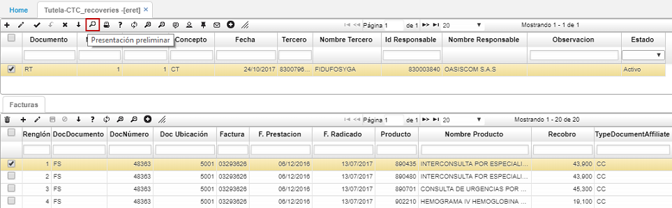
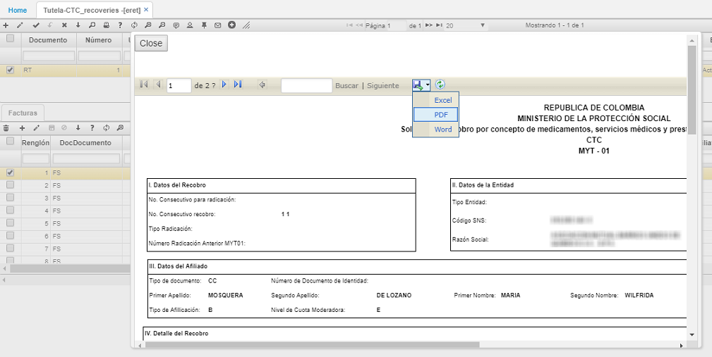
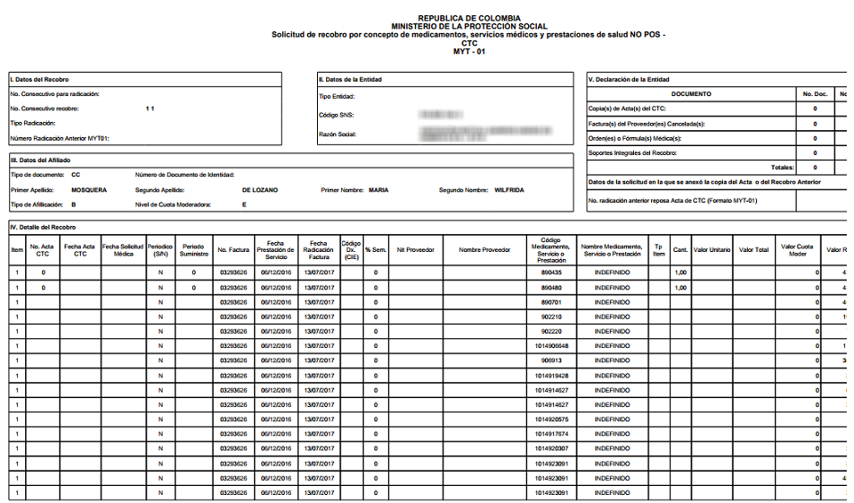

# ERET - Tutela-CTC-Recobros

## Vista previa

La aplicación ERET cuenta con una vista previa que permite ver los documentos MYT01 y MYT02.  

#### [MYT01](http://docs.oasiscom.com/Operacion/is/salud/eautorizacion/movrec/eret#myt01)

Vista previa de solicitud de recobro por concepto de medicamentos, servicios médicos y prestaciones de salud NO POS - CTC. Recuerda que los formatos de vistas previas deben ser parametrizados o asignados previamente en la aplicación [**BDOC - Documentos**](http://docs.oasiscom.com/Operacion/common/bsistema/bdoc#parametrización-de-formatos-de-impresión).  

Seguidamente veremos una ventana con la vista previa del documento. También tenemos la posibilidad de exportar el archivo en formato Excel, PDF o Word.  

Formato en PDF:

#### [MYT02](http://docs.oasiscom.com/Operacion/is/salud/eautorizacion/movrec/eret#myt02)

Vista previa de solicitud de recobro por concepto de medicamentos, servicios médicos y prestaciones de salud ordenados por fallos de tutelas. Recuerda que los formatos de vistas previas deben ser parametrizados o asignados previamente en la aplicación [**BDOC - Documentos**](http://docs.oasiscom.com/Operacion/common/bsistema/bdoc#parametrización-de-formatos-de-impresión).  

Para acceder damos click en el botón .  

Seguidamente veremos una ventana con la vista previa del documento. También tenemos la posibilidad de exportar el archivo en formato Excel, PDF o Word.  

Formato en PDF:  

