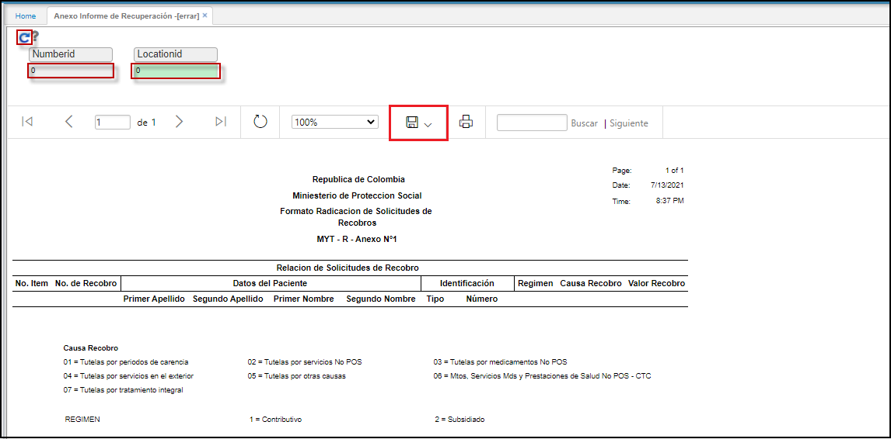

# Formato Radicacion Solicitudes Recobros - ERRAR

El reporte **ERRAR** permite ver el formato radicacion de solicitudes de recobros.  

Ingresamos a la aplicación, filtramos por numero y ubicación. Damos click en el botón _Generar_.  

	

