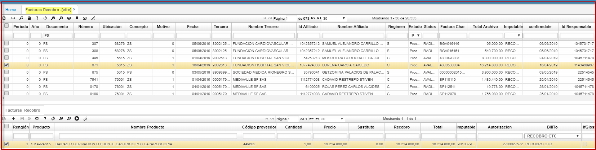

# RECOBROS - EFRC 

* Recobros: las IPS que prestan los servicios no POS le cobran a las EPS por estos y a su vez las Entidades Promotoras de Salud, le recobran al Estado estos procedimientos, medicamentos y dispositivos.  

Para verificar las facturas que se deben recobrar, se ingresa a la aplicación **EFRC** y se consulta.  

  

En el detalle de la aplicación **EFRC** se visualiza el producto a recobrar, codigo del proveedor, cantidad, precio, sustituto, recobro, el valor del recobro entre otros campos a editar.

  

El campo sustituto y recobro deben ser diligenciados, correspondiendo el campo sustituto al valor del producto o servicio alterno al que se está recobrando, claro está, en caso tal que dicho producto o servicio posea sustituto, de lo contrario se deja 0. El campo recobro hace referencia al valor total por el cual se va a efectuar el recobro.  

  

Una vez diligenciado completamente el detalle, en el maestro se debe activar el Check de “revisado”, los Check de enviado y recibido deben estar previamente marcados. Finalmente, se ejecuta el proceso dando clic en el botón superior derecho R (Recobro).  

  

Al ejecutar el proceso anterior, si la factura que se recobró anteriormente en el detalle tenía sustituto, el cual debe estar definido en la aplicación EPRO, el sistema crea dos documentos en la aplicación ERET Recobros Tutela - CTC:  

* Un primer documento RT (Recobro tutela-CTC) por el concepto con el cual se generó el recobro en la aplicación EFRC, sea CT (Comité técnico científico) o TU (Tutelas). En el detalle, si se deben recobrar varias facturas a un mismo tercero con el mismo tipo de recobro (CT) o (TU), la aplicación almacena dichas facturas recobradas en un paquete, alimentándolo cuantas veces se recobre al mismo tercero.  

  

* Un segundo documento NR (No recobro tutela-CTC) por concepto Indefinido, hace de contra partida del primer documento RT. En el detalle, si se deben recobrar varias facturas a un mismo tercero con el mismo tipo de recobro (CT) o (TU), la aplicación almacena dichas facturas recobradas en un paquete, alimentándolo cuantas veces se recobre al mismo tercero.  

  

Si la factura de recobro en el detalle de la aplicación EFRC no tiene sustituto, el sistema solo genera el documento RT (Recobro tutela-CTC) en ERET.  

Al procesar el primer documento RT (Recobro tutela-CTC), se genera una factura en FFAC - FC por el total de facturas recobradas al tercero.  

  

Igualmente, al procesar el documento NR (No recobro tutela-CTC), el sistema genera una nota de contabilidad en KMOV - NK.   

  

Nota: Para poder procesar los anteriores documentos generados en ERET, estos deben estar previamente parametrizados en BPLA.  

Parametrización de factura de venta por concepto de Tutelas: documento FC por concepto TU.  

  

Parametrización de factura de venta por concepto de Actas: documento CT por concepto CT.  

  

El documento NK Nota de Contabilidad no requiere parametrización en BPLA para los conceptos CT Actas y TU Tutelas.  

**************

