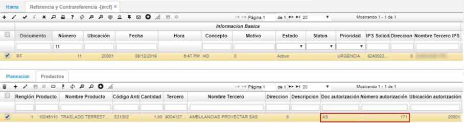

# ERCF - Referencia y Contrareferencia

Por medio de la aplicación **ERCF – Referencia y Contrareferencia,** se registra la gestión o trámites que se han realizado hacia un afiliado, para que otro prestador de servicios o IPS pueda brindarle el servicio que necesita el afiliado y poder trasladarlo.
Para registrar una nueva referencia y contrareferencia, ingresamos a la aplicación ERCF y creamos un nuevo registro.

En el formulario seleccionamos el concepto *HO – Hospitalaria* y el motivo por el cual se va a realizar la referencia.

Seguidamente, seleccionamos la prioridad de la referencia (Electiva / Urgencia) e ingresamos en el campo *“IPS Solicitante”,* el número de identificación de la IPS que está registrando la referencia.

En la siguiente sección del formulario, se deben ingresar los datos del paciente y del acompañante.

Finalmente, se deben ingresar los datos del profesional que está remitiendo el servicio y la información clínica del paciente.

Diligenciado el formulario, damos clic en *“Guardar”.* Al guardar el formulario, el sistema creará en la pestaña **_“Planeación”_** del detalle, el primer renglón con la acción *“Registro”.*

Posterior a este registro, se deben continuar registrando los renglones correspondientes a la gestión realizada a la referencia hasta que llegue a su cierre.

Para registrar una actividad, agregamos un nuevo renglón y seleccionamos en el campo “Tipo” si está en trámite o si es el cierre de la referencia.

Seguidamente, indicamos cuál es la acción realizada para la referencia, la fecha en que se realiza, seleccionamos la IPS a la cual se le solicita el servicio, indicamos cuál es el estado del paciente, realizamos una descripción de la respuesta obtenida por la IPS y la información de quien dio la respuesta.

Si finalmente, un prestador de servicio acepta la remisión, el registro será de tipo *“Cierre”.* Para esta opción se habilitarán las siguientes acciones diferentes a las de tipo *“Trámite”:*

Diligenciamos los demás campos correspondientes al cierre de la referencia y contrareferencia y guardamos el registro.

Si el prestador de servicios acepta la remisión, en la pestaña **_“Productos”_** se ingresa el o los servicios que le van a brindar dicho prestador de servicios al paciente.  Es posible adicionar varios productos al servicio que requiere el afiliado.

## [Generar autorización](http://docs.oasiscom.com/Operacion/is/salud/eautorizacion/movref#generar-autorización)

Agregados los productos en la pestaña *“Productos”* de la aplicación ERCF, damos clic en el botón *“Generar autorización”* ubicado en la barra de herramientas del detalle, el cual creará una autorización en la aplicación **_EAUT - Autorizaciones_** en estado *Procesado*.

**Nota:** La autorización se generará siempre y cuando se cuente con un contrato activo con la IPS que recibe el paciente o presta el servicio.

Al dar clic en el botón **_“Generar autorización”,_** en el campo *“Número Autorización”* aparecerá el consecutivo con el cual se generó y con el cual podremos consultar en la aplicación **EAUT - Autorizaciones.**

En la aplicación **EAUT - Autorizaciones** ingresamos a validar la creación de la autorización con el número consecutivo visualizado anteriormente en el detalle de la aplicación **ERCF.**

En los campos *“Documento1” y “DocNúmero”* de la autorización seleccionada, podemos visualizar el número de consecutivo de la referencia y contrareferencia creada anteriormente en la aplicación ERCF y a la cual está asociada la autorización.

La aplicación EAUT cuenta con vista previa para exportar o imprimir la autorización.

