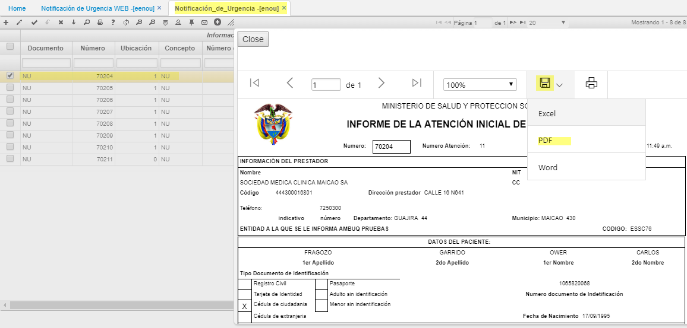

# URGENCIAS
## INFORME DE LA ATENCIÓN INICIAL DE URGENCIAS - ENOU

La opcion **ENOU** Notificación Urgencia: En esta aplicación el usuario puede consultar las notificaciones de urgencias emitidas por las IPS’s.
Permite los diferentes tipos de adjuntos, como soporte de la urgencia.  

