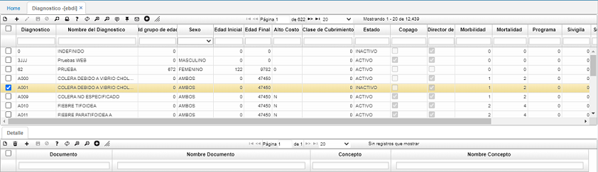

# Diagnóstico - EBDI  

Esta aplicación permite realizar la parametrización de la tabla maestra de los diagnósticos estándar del CIE10.  

  

_**Diagnóstico:**_ Código del diagnóstico CIE10.  
_**Nombre del diagnóstico:**_  Nombre del diagnóstico CIE10.  
_**Sexo:**_ Sexo de la persona que aplica a ese diagnóstico.  
_**Edad  Inicial:**_ Edad  inicial  en  días  de  las  personas  a  las  cuales  aplica  el diagnostico. Control para el rango de edades.  
_**Edad  Final:**_ Edad  final  en  días  de  las  personas  a  las  cuales  les  aplica  el diagnóstico. Control para el rango de edades.  
_**Alto  Costo:**_ 1. Establece  si  el  diagnóstico  es  o  no  de  alto  costo  para  una prestación de servicios[EAUT]. 2. Son clasificados o requeridos para realizar Siniestros (ESIN) con el objetivo de llevar control y seguimiento del afiliado según su evolución o deterioro. 3. Evita el cobro de copagos en la prestación del  servicio  (EAUT)  al  afiliado  del  régimen  subsidiado en  colaboración  del procedimiento o servicio este también está marcado como alto costo.  
_**Estado:**_Estado del diagnóstico en el sistema.  
_**Copago:**_ Define si por el diagnostico el afiliado debe pagar copagos, según el subsidio a la Oferta. Esto aplica en la prestación de Servicios (EAUT).Princ.: Aplica o no el diagnóstico como principal. S.Parcial: Aplica o no el diagnóstico para subsidio parcial.  
_**Morbilidad:**_ Código de la morbilidad [EBMB]que se relaciona al diagnóstico.    
_**Mortalidad:**_ Código de la mortalidad [EBMR] que se relaciona al diagnóstico.    
_**Programa:**_ Este campo no aplica.   
_**Sivigila:**_ Código del evento SIVIGILA [EBSI] que se relaciona al diagnóstico.    
_**Sífilis:**_ Aplica o no el diagnóstico para sífilis.  
_**Gestante:**_ Aplica o no el diagnóstico para madre gestante. 
_**TB:**_ Aplica o no el diagnóstico para tuberculosis.   
