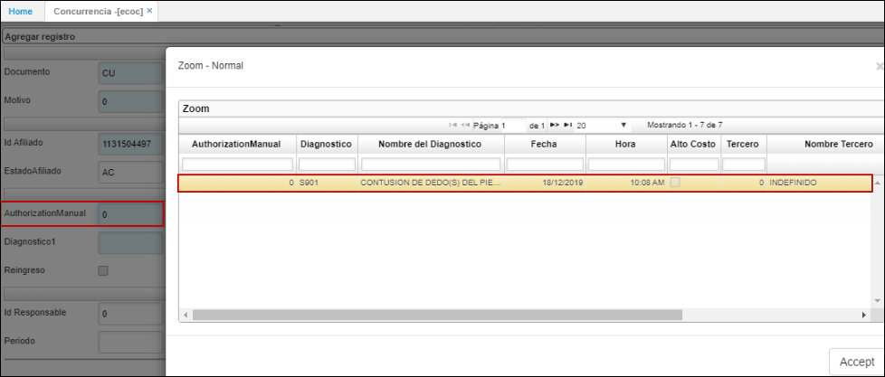
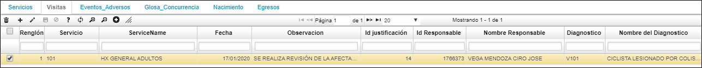
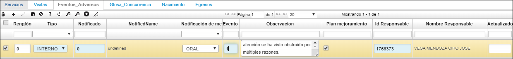
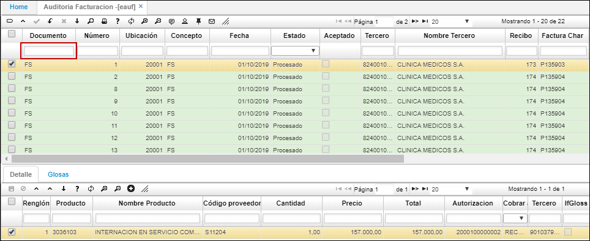
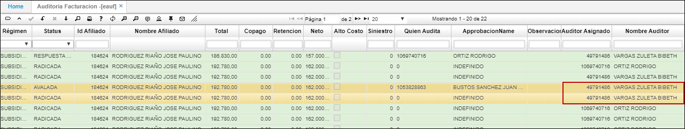
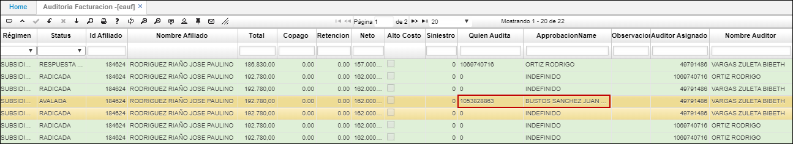
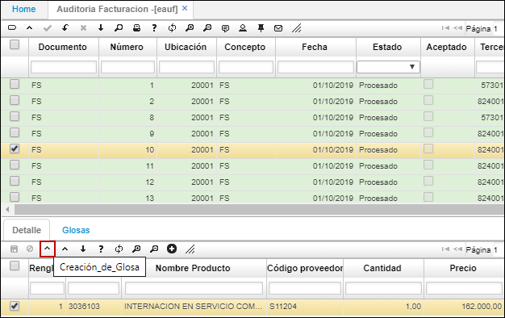
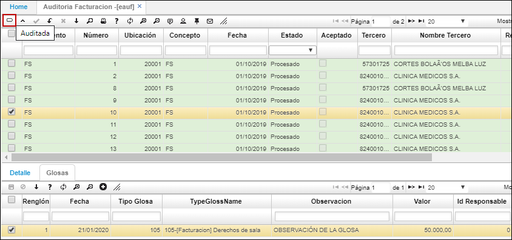

---

layout: default
title: Concurrencia
permalink: /Operacion/is/salud/ebasica/ecoc
editable: si

---
# ECOC - Concurrencia

Para determinar el estimado de dinero que se pierde por la NO oportunidad en los procesos de gestión de la concurrencia y demás áreas de salud.
Se crea en Concurrencia - ECOC para el módulo de salud, la pestaña "Fuga" como tipos causas, Inoportunidad en programación en prestador externo, Inoportunidad en reporte de prestador externo, Suministros, referencia, Plan domiciliario, Oxigeno, Ambulancia, entre otras.

- [Auditoría Concurrente](http://docs.oasiscom.com/Operacion/is/salud/ebasica/ecoc#auditoría-concurrente)
- [Detalle de la aplicación ECOC](http://docs.oasiscom.com/Operacion/is/salud/ebasica/ecoc#Detalle-de-la-aplicación-ECOC-Concurrencia)
**-Pestaña Servicios.
-Pestaña Visitas.
-Pestaña Eventos Adversos.**
- [Auditoría POS / Cuentas Médicas](http://docs.oasiscom.com/Operacion/is/salud/ebasica/ecoc#Auditoría-POS/Cuentas-Médicas)
**-Detalle aplicación EAUF – Auditoría Facturación**

Cuando se realizan las novedades puedan consultarlo tanto por el clientid o clientcode, desplazando el cursor a la derecha de la opcion **ECOC.**

## [Auditoría Concurrente](http://docs.oasiscom.com/Operacion/is/salud/ebasica/ecoc#auditoría-concurrente)

Por medio de la aplicación **ECOC – Concurrencia,** se registran las auditorías concurrentes realizadas a las IPS.

Para registrar una auditoría ingresamos a la aplicación, creamos un nuevo registro y diligenciamos el formulario.

En el formulario ingresamos documento y concepto CU, seleccionamos la ubicación del zoom, ingresamos motivo 0 y seleccionamos el *Id del Afiliado* a quien se le vaya a realizar la auditoría concurrente. Los siguientes datos del afiliado se diligenciarán automáticamente.

Seguidamente, en el campo *“AuthorizationManual”* ingresamos al zoom y seleccionamos una de las autorizaciones que tenga asociada el afiliado.

Al seleccionar la autorización, el sistema traerá los datos de *tercero, nombre de tercero, diagnóstico, nombre de diagnóstico.* Continuamos seleccionando en el campo Vía ingreso el medio por el cual ingresó el afiliado (Remitido, consulta externa, programado ambulatorio, urgencias).

Digitamos fecha de ingreso del afiliado, en caso de que el afiliado ya haya sido dado de alta por algún motivo, en el campo Egresos se deberá seleccionar la fecha en la cual salió. El campo *Cantidad días* será diligenciado por el sistema al momento de guardar el registro.

Por último, en el campo Id Responsable se ingresa el número de identificación del usuario que está registrando la auditoría en la aplicación ECOC.

Finalmente, damos clic en el botón *Guardar,* el sistema arrojará un mensaje de confirmación del registro.

El registro del documento CU debe estar en estado *Activo* mientras el afiliado se encuentre en atención, una vez se le de salida, el registro se debe procesar.

### [Detalle de la aplicación ECOC - Concurrencia](http://docs.oasiscom.com/Operacion/is/salud/ebasica/ecoc#Detalle-de-la-aplicación-ECOC-Concurrencia)

**Pestaña Servicios**

En la pestaña *Servicios* del detalle, se debe relacionar el o los servicios que se le han brindado al afiliado desde su ingreso hasta que se da de alta.

Agregamos un nuevo renglón y seleccionamos del campo Servicio, el servicio brindado al afiliado, seguidamente seleccionamos en tipo de servicio si estuvo en un ambiente de múltiples camas o unipersonal, a continuación, indicamos la fecha de entrada, la cual es la fecha en la que ingresó el afiliado a solicitar el servicio, igualmente para la fecha de salida será cuando el afiliado se dé de alta. En caso tal de que el afiliado aún se encuentre recibiendo el servicio, el campo Salida no se debe diligenciar.

Finalmente guardamos los cambios en el renglón del detalle.

**Pestaña Visitas**

En la pestaña *Visitas* del detalle, se deben registrar los servicios que se le están prestando al afiliado.

Agregamos un nuevo renglón y diligenciamos los campos. En el campo *Servicio* damos doble clic y seleccionamos del zoom el servicio que se le está prestando al afiliado, seguidamente, seleccionar la fecha en que se prestó el servicio.

En el campo *Observación* se debe realizar una descripción de la visita del servicio prestado al afiliado y mencionar los comentarios necesarios, a continuación, se debe también seleccionar del zoom del campo *Id Justificación,* el motivo o justificación por el cual se realizó la visita.

Completando el renglón, se debe seleccionar en el campo *Id Responsable,* la persona que está diligenciando el registro. Seguidamente, indicar en el campo *Diagnóstico,* cuál fue el diagnóstico identificado en la visita y por último en el campo *Cargo* indicar el cargo de la persona que realiza o define el diagnóstico.

**Pestaña Eventos Adversos**

La pestaña de *Eventos Adversos* permite registrar los diferentes eventos o situaciones adversas que se puedan presentar al momento de prestar el servicio al afiliado.

Se agrega un nuevo renglón y se diligencian los campos.

Seleccionar en *Tipo* si el evento se presentó a nivel interno o externo de la entidad, en *Notificado* seleccionar a quién fue notificado el evento, indicar de qué forma se comunicó el evento y en el zoom del campo *Evento,* seleccionar cuál fue el evento adverso que se presenció. Seguidamente, en el campo *Observaciones,* hacer una descripción de lo sucedido en el evento adverso e indicar a continuación si se requiere plantear un plan de mejoramiento para la situación. Finalmente, el usuario que está diligenciando el registro debe ir asignado en el campo *Id Responsable.*

Finalmente, el detalle de la aplicación *ECOC – Concurrencia* cuenta con tres pestañas más a las anteriormente mencionadas:

*Glosas concurrencia,* la cual se diligencia en caso tal de que sea necesario cargar al usuario alguna glosa por la prestación del servicio.

*Nacimiento,* se diligencia en caso tal de que, durante la prestación del servicio al afiliado, se haya atendido un nacimiento a este.

*Egresos,* la pestaña de Egresos se debe diligenciar cuando el afiliado se da de alta o se termina la prestación del servicio por deceso de este.

Si al afiliado aún se le están brindando servicios de salud, el registro de la auditoría concurrente debe mantener en estado **ACTIVO.** En el momento que se dé de alta al afiliado o se termine la prestación del servicio, se debe procesar el registro y este pasará a estado **PROCESADO.**

## [Auditoría POS / Cuentas Médicas](http://docs.oasiscom.com/Operacion/is/salud/ebasica/ecoc#Auditoría-POS/Cuentas-Médicas)

Por medio de la aplicación **EAUF – Auditoría Facturación,** se realiza el proceso para auditar las facturas radicadas en el RIP (Registro Individual de Prestación de Servicio). Esta auditoría es realizada por la EPS.

Para iniciar, los auditores de las facturas deben ingresar a la aplicación EAUF y consultar todas las facturas radicadas dando *Enter* en alguno de los campos de filtro.

Desde la aplicación EAUF es posible asignar las auditorías de las facturas a diferentes auditores, para ello, se seleccionan las facturas que se desean asignar a un auditor y se da clic en el botón *“Asignar auditor”* de la barra de herramientas.

El sistema arrojará una ventana emergente en donde en el campo **_“Empleado”_** ingresamos el número de identificación del auditor a quien se le asignarán las facturas seleccionadas o lo seleccionamos del zoom y damos clic en el botón *“Submit”.*

El sistema arrojará un mensaje de confirmación indicando que la asignación ha sido exitosa.

En el campo **_“Auditor Asignado”_** y **_“Nombre Auditor”_** de la misma aplicación EAUF se visualiza el auditor asignado a las facturas.

**Nota:** Las auditorías a las facturas no obligatoriamente el sistema las restringe a que las realice el empleado asignado, por ello, también se cuenta con el campo **_“Quien Audita”,_** en donde el auditor que realice la revisión a esa factura debe ingresar su número de identificación, lo que indica que fue quien la auditó

**Detalle aplicación EAUF – Auditoría Facturación**

En la pestaña *“Detalle”* de la aplicación **EAUF – Auditoría Facturación** se visualiza el servicio que fue prestado al afiliado.

Según el servicio brindado, el auditor puede crear una glosa a la factura dando clic en el botón de la barra de herramientas del detalle *“Creación de Glosa”*

Al dar clic en el botón *“Creación de Glosa”* aparecerá una ventana emergente en donde se debe adicionar desde el botón “+” un renglón para registrar la glosa, allí seleccionamos el tipo de glosa, hacemos una observación e indicamos el valor que se va a glosar. Finalmente damos clic en el botón *“Guardar”* de la barra de herramientas.

El sistema arrojará un mensaje de confirmación indicando que el registro fue exitoso.

La glosa creada se va a visualizar en la pestaña del detalle *“Glosas”.*

Después de creadas las glosas en la factura, se debe dar clic en el botón *“Auditada”* ubicado en la barra de herramientas del maestro.

Después de dar clic en el botón *“Auditada”,* el sistema creará un documento **FD** en estado Activo en la aplicación **EFAC - Facturas,** en donde se mostrarán las glosas creadas por cada factura.

En los campos **_“Documento 1”_** y **_“Número 1”_** se puede visualizar la factura con la que se está relacionando la glosa, estos campos también nos sirve para consultar la factura auditada anteriormente en EAUF.

