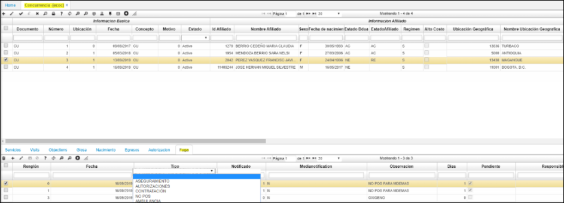

# ECOC - Concurrencia  

Para determinar el estimado de dinero que se pierde por la NO oportunidad en los procesos de gestión de la concurrencia y demás áreas de salud.   
Se crea en Concurrencia **[ECOC]** para el módulo de salud, la pestaña "Fuga" como tipos causas:   
* Inoportunidad en programación en prestador externo,  
* Inoportunidad en reporte de prestador externo,  
* Suministros, referencia,  
* Plan domiciliario,  
* Oxigeno,  
* Ambulancia, entre otras  

  

